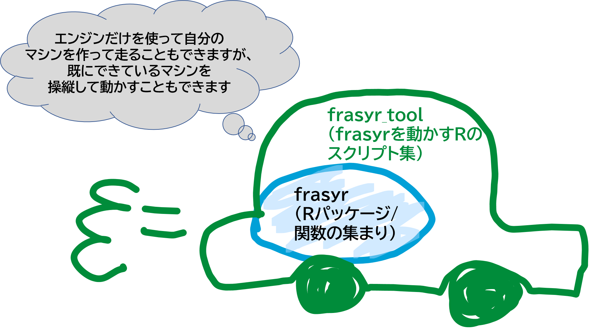

### [frasyr](https://github.com/ichimomo/frasyr)
   - 1系資源のVPA計算・管理基準値計算・将来予測シミュレーションを行うための関数を集めたRパッケージ
   - ブランチ構成
      - master: 安定版のみの配布。2-3ヶ月に一回更新されます。また、大きな会議が終わったあとに、会議で使ったパッケージのバージョンを保存します。
	  - dev: 開発用のブランチ。常に最新の修正結果がアップされます
   - インストール方法などは、トップページの[README](https://github.com/ichimomo/frasyr/blob/master/README.md)を見るか、以下のfrasryr_toolで配布されているスクリプトを使ってインストールしてください。
	  
### [fraysr_tool](https://github.com/ichimomo/frasyr_tool)
   - frasyrを動かすためのRスクリプトを集めたファイル集（パッケージではありません）。水研内部のみのプライベートレポジトリになります。利用したい場合はgithubのIDを取得し、IDを市野川までご連絡ください。
   - 一般的な使い方はトップページの[README](https://github.com/ichimomo/frasyr_tool/blob/master/README.md)をご参照ください
   - ブランチ構成
      - master: 1週間一度くらいの頻度で大幅更新した安定版をアップしようと思っています。以前のダウンロード版が問題なくても、機能が追加されていることもあるので、定期的に最新のmaster版に更新してください
	  - dev: issueで報告のあったバグなどを取り込んだ最新バージョン。
   - ディレクトリ構成
      - old_script: 過去配布していた(frasyr v1.20未満に対応)スクリプト
      - script_SC2020: 2020年に開催される研究機関会議用のスクリプト。各スクリプトの説明は[こちら](https://github.com/ichimomo/frasyr_tool/tree/master/script_SC2020#%E3%83%95%E3%82%A1%E3%82%A4%E3%83%AB%E3%81%AE%E8%AA%AC%E6%98%8E)
      - data_SC2020: 上記の会議で利用されるVPA結果などをおいています
      - documents_SC2020: 上記の会議で紹介されたドキュメントを再現するRスクリプト
      - SRcheck: 再生産関係のモデル診断をするためのスクリプト集。解説は[こちら](https://github.com/ichimomo/frasyr_tool/blob/master/SRcheck/SRdiagnostics.md)
     
### 各種情報

上記のレポジトリ内のwikiやhtmlページにいくつか情報を載せています。点在しているので、ここに情報を]まとめます
   - [frasyrのWiki](https://github.com/ichimomo/frasyr/wiki)には以下の情報があります
      - [frasyr各種便利関数の紹介](https://github.com/ichimomo/frasyr/wiki/Cheat-Sheet)
      - [再生産関係のパラメータ推定におけるモデル診断手順](https://github.com/ichimomo/frasyr/wiki/Diagnostics-for-Stock-Recruitment-Relationships)
      - [将来予測関数の使い方] (https://github.com/ichimomo/frasyr/wiki/future_new)
      - [frasyrブランチ運用方法(開発者向け)](https://github.com/ichimomo/frasyr/wiki/Branch-Operation-manual)
      - [frasyr開発手順について(開発者向け)](https://github.com/ichimomo/frasyr/wiki/Development-Policy)
	  
   - fraysrのvignette. VPAによる資源量推定の例があります。vignetteは使いづらいので、他のものはwikiに移しました。
      - VPAによる資源量推定　https://ichimomo.github.io/frasyr/doc/vpa.html
	  
   - [frasyr_toolのWiki](https://github.com/ichimomo/frasyr_tool/wiki)には以下の情報があります
      - [fraysr_toolのスクリプトがうまく動かない場合の相談のしかた](https://github.com/ichimomo/frasyr_tool/wiki/%E3%83%90%E3%82%B0%E5%A0%B1%E5%91%8A%E3%83%BB%E3%82%A8%E3%83%A9%E3%83%BC%E7%9B%B8%E8%AB%87%E3%81%AE%E3%82%84%E3%82%8A%E3%81%8B%E3%81%9F)。問題あったかたはまずこちらをご一読し，その後，issueかチームスかどちらかに質問を投げてください．
      - [fraysr_toolの途中で出力される再生産関係の比較の表の見方](https://github.com/ichimomo/frasyr_tool/wiki/%E5%86%8D%E7%94%9F%E7%94%A3%E9%96%A2%E4%BF%82%E3%81%AE%E8%A1%A8%E3%81%AE%E8%A6%8B%E6%96%B9)
	
## その他のレポジトリ

### [future-text](https://github.com/ichimomo/future-text)
   - fraysrの計算方法を数式で解説しています
   - 年度ごとにバージョンが異なります。現状は、H31年度版と令和2年版があり、令和2年版を更新中です。
   
### [frasyr23](https://github.com/ichimomo/frasyr23)
   - 2・3系資源をHCRでABC計算するときの関数を提供します
   
### その他
   - 再生産関係の選択の基準に関する[事例集](http://abchan.fra.go.jp/nc/htdocs/?action=cabinet_action_main_download&block_id=1543&room_id=765&cabinet_id=78&file_id=6204&upload_id=9747)（内部のみ） 

