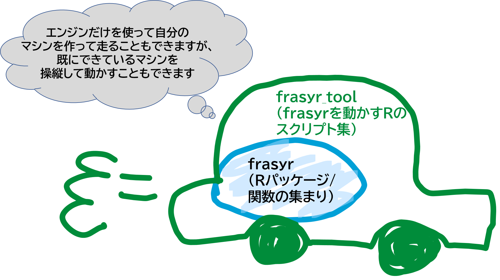

- [このページのHP版](https://ichimomo.github.io/main/)
- [昔のホームページ(更新停止中、古い情報を含みます)](https://ichimomo.github.io/main/home-page/index.html)

### [frasyr](https://github.com/ichimomo/frasyr)
   - 1系資源のVPA計算・管理基準値計算・将来予測シミュレーションを行うための関数を集めたRパッケージ
   - ブランチ構成
      - dev: 最新版です。節目節目でバージョン番号をつけますが、不定期なので、パッケージのバージョンを引用したい場合はコミット番号をご利用ください。
   - インストール方法などは、トップページの[README](https://github.com/ichimomo/frasyr/blob/master/README.md)を見るか、以下のfrasryr_toolで配布されているスクリプトを使ってインストールしてください。

### [fraysr_tool](https://github.com/ichimomo/frasyr_tool)
   - frasyrを動かすためのRスクリプトを集めたファイル集（パッケージではありません）。水研内部のみのプライベートレポジトリになります。利用したい場合はgithubのIDを取得し、IDを市野川までご連絡ください。
   - 使い方はトップページの[README](https://github.com/ichimomo/frasyr_tool/blob/master/README.md)をご参照ください

### 各種情報ローカル
 - VPA
   - [資源量推定の方法](https://ichimomo.github.io/frasyr/articles/vpa.html)
   - [モデル診断の方法](https://ichimomo.github.io/frasyr/articles/Diagnostics-for-VPA.html)
- 再生産関係
  - [推定方法](https://ichimomo.github.io/frasyr/articles/fittingSR.html)
  - [モデル診断方法](https://github.com/ichimomo/frasyr_tool/tree/YR2024/SRcheck) ※(プライベートリポジトリです)

## その他のレポジトリ

### [future-text](https://github.com/ichimomo/future-text)
   - fraysrの計算方法を数式で解説しています
   - 年度ごとにバージョンが異なります

### [frasyr23](https://github.com/ichimomo/frasyr23)
   - 2・3系資源をHCRでABC計算するときの関数を提供します

### その他
- [tidyverse連載](https://github.com/ichimomo/main/blob/master/tidyverse)　Rを使うときに欠かせないtidyverseをちょっとづつ解説しています
- [Rで使えるデバッグ技まとめ](https://github.com/ichimomo/main/blob/master/R/debugging_method/README.md)

#### frasyrとfrasyr_toolの関係

