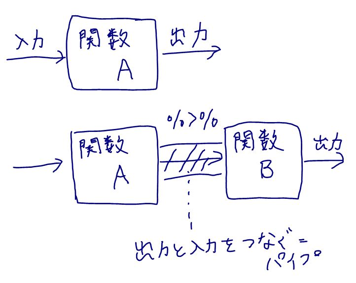
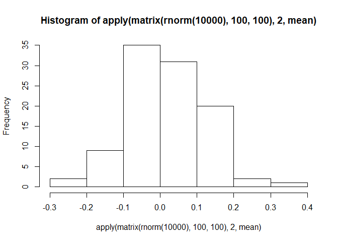
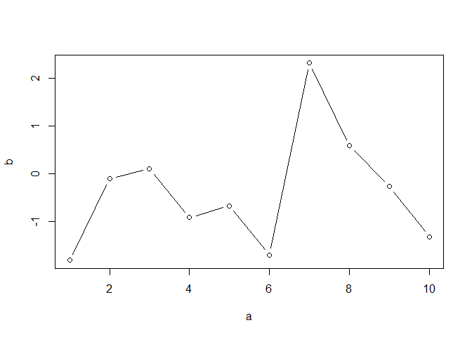

5日目：（ちょっと寄り道）%&gt;% について
----------------------------------------

前回の最後に、次はデータの縦横変換について解説すると書きましたが、それに入る前に、tidyverseでコードを書いているとよく出現する謎の記号
`%>%`（dplyrパッケージに含まれます） について解説します。
Rで使われる記号 `+`
とか`%`とかはよく目にすると思います。`%>%`もその仲間で、プログラミング言語上で一般に「パイプ」と呼ばれる働きをします。「パイプ」は下図のように、関数Aの出力値を関数Bの入力値に繋げるような動作です。

`%>%`はtidyverseを使うから使わないといけないというわけではありませんが、tidyverseが提供する関数と相性が良い（たぶんそのようになるように設計されているんだと思います）ので、tidyverseを使ったコードで`%>%`は頻出します。frasyr\_toolでも`%>%`はよく出てきます。わかってしまえばそんなに難しいものではないので、ここで`%>%`の使い方に慣れ、そのメリットについて学びましょう。

### 実例

さきも書いたように`%>%`は関数の「出力」をそのまま別の関数の「入力」につなげる役割をします。

単純な例としては、1:10までの数を足して、その平方根をとって、結果を表示するという作業をやってみます。愚直に書くと、

    x <- 1:10
    x <- mean(x)
    x <- sqrt(x)
    print(x)

    [1] 2.345208

となりますね。また、Rでは代入をいちいち省略して一行で

    x <- print(sqrt(mean(1:10)))

    [1] 2.345208

のように書くこともできます。

しかし、１行で一気に書いてしまうと、１～10を平均して平方根をとって表示するというプロセスが逆の入れ子状になっていて（「表示する（平方根をとる(平均する（1から10の数）））」、もっと複雑な処理になったとき、プログラムの可読性（読みやすさ）が非常に悪くなります。一方で、一番最初の例のように4行で書く場合、同じ変数`x`に何度も異なる数を代入しているため、**最終的にxがどのような数になるのか、最後の行を読むまでわかりません**。

以下のように、それぞれの値に中身がわかるように名前を付ける方法もあります。大規模なプログラムで、途中経過が大事な場合にはこのような方法が勧められますが、一時的においておくだけの変数にもすべて名前をつけるのは膨大な作業で、また、名前がコンフリクトして(間違って別の変数に同じ名前をつけて）しまう可能性があります。

    x_value <- 1:10
    x_mean <- mean(x)
    x_sqrt <- sqrt(x)
    print(x)

    [1] 2.345208

そこで、パイプ`%>%`の登場です。上の例はパイプを使って

    library(tidyverse)
    x <- 1:10 %>%
          mean() %>% # 上の行(1:10)が関数meanの一番目の引数になる
          sqrt() %>% # 上の行の関数meanの結果がsqrtの一番目の引数になる
          print() # 同様

    [1] 2.345208

のように書くことができます。1～10の数を、平均して、平方根をとり、値を表示する、そしてをれをｘに代入するという一連の作業が（パイプに慣れれば）一目でわかります。

### パイプクイズ：以下のRコードをパイプを使って書き直しましょう

Q1:

    hist(apply(matrix(rnorm(10000), 100, 100), 2, mean))

A1:

    rnorm(10000) %>% matrix(100, 100) %>% apply(2, mean) %>% hist()

Q2:

    dat_example <- tibble::tibble(a = 1:10, b = rnorm(10))
    plot(dat_example, type = "b")

A3:

    tibble::tibble(a = 1:10, b = rnorm(10)) %>% plot(type = "b")

ほとにわかりやすいか？と疑問にもたれるかたもいらっしゃると思いますが、tidyverseの関数を使うとほんとにわかりやすくなるんです、、、。次回以降、tidyverseの主要な機能を解説していくので、そのときにパイプも一緒に使っていきます。

さらに、`.`(一番最初の引数以外のところにパイプする)とか、`%T>%`(途中でグラフを出力する)とか、`%$%`（データフレームの変数をそのまま使う）とか、途中で`->`を挟むとか、いろいろあるようです（わたしもまだそのあたり使いこなせていません）。たとえば　<a href="https://www.medi-08-data-06.work/entry/paipe_r" class="uri">https://www.medi-08-data-06.work/entry/paipe_r</a>　とか参照ください。
