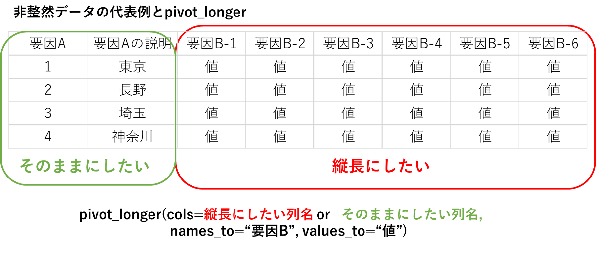

6日目：データの横→縦変換
------------------------

では、６日目、とうとうデータを縦横に変換していきます。といってもそんなに難しいことはなく、`tidyr`パッケージにある`pivot_longer`
(横長データを縦長データへ)と、`pivot_wider`（縦長データを横長データへ）を使います。以前は、`spread`、`gather`という名前の関数が使われていましたが、いまいち名前がわかりにくいということで、`pivot_longer`、`pivot_wider`に変わったようです。たしかに、以前の関数名のときは、どっちがどっちかわからなくて毎回ググるはめになっていたんですが、新しい関数名だとググらなくても名前から機能が想像できますね。

４日目に解説したように、縦長のデータは整然データ、横長のデータは非整然データに対応しますが、「整然データ」というと、最初に整然データの概念を提唱したWickham
(2014)の定義にちゃんと従っているデータ、というような印象を受けるような気がするので、（特別に「整然データ」であることを強調したいとき以外は）ここでは縦長・横長データと言います。

横長データを縦長データへ：`pivot_longer`
----------------------------------------

データをとった（もらった）がめっちゃ雑然としている、、。解析するためにはまずこれを「整然」データに直さないといけない、、というのがだいたいデータを解析するときの、一番最初にする作業だと思います。

「幸福な家族はどれも似ているが、不幸な家族は不幸のあり方がそれぞれ異なっている。」とはトルストイの名言ですが、整然（縦長）データを定義したWickham
(2014)
は、「家族と同じく、整然データセットはどれも似ているが、雑然データセットは雑然のあり方がそれぞれ異なっている」と述べています。つまり、雑然としているデータの雑然度合いは、それぞればらばらなので、非整然データを整然データに成型するやり方を統一的に提供するのはなかなか難しいです。

なので、ここでは、表１（４日目）で示した一般的な横長データを、表２のような縦長データに変換するときのコマンドを軽く紹介します。個々の事例（こんなデータの場合はどうする？）については、別途、例を出しあって解決方法を探ることにしましょう。

    # 表1の横長データ
    data1 <- rbind(c(1000, 720, 420, 100), c(120, 50, 20, 10))

    # pivot_longerを使って縦長データへ変換する
    data1_long <- data1 %>% as.data.frame() %>% tibble::rownames_to_column(var = "area") %>% tidyr::pivot_longer(col = -area,
        names_to = "year", values_to = "CPUE")

    # (補足) 裸のRでやる場合
    data1_long2 <- as.data.frame.table(data1)
    colnames(data1_long2) <- c("area", "year", "value")

上のコードの1行目では、`data1`をデータフレーム（data.frame）形式に変換しています。これは、２行目で実行するtibble::rownames\_to\_column
関数がdata.frame（またはtibble形式）でないと受け付けてくれないからです。（ここで`tibble::as_tibble`でtibble形式にする方法もありますが、その場合には行の名前が失われてしまって２行目で困るので、ここではdata.frameにしています。）

２行目では、data1に行名（rownames）として記録されていた地点A、地点Bといった情報を「列(col)」データに出力しています。そのためのコマンドが`tibble::rownames_to_column`です（私もこれを書いているときに知りました）。引数`var`では、新しい列の名前、ここでは“area”としました、を指定します。これを指定しなくても関数は動きます。その場合とデフォルト値のの`rownames`という名前がつきます。

そして３行目でいよいよ`tidyr::pivot_longer`でデータを縦長に変換します。引数colでは
**縦に並べたい列の名前** を指定します。
ここでは「area以外全部の列」を縦に並べたいので、`-area`というふうに指定します。あと、`names_to`は縦に並べたときに新しくできる要素の列の名前（指定しないとデフォルト値の“name”となります）、`values_to`は新しくできる値の列の名前（指定しないとデフォルトの“value”となります）。

わかりやすいかどうかはわかりませんが、以下、pivot\_longerの構造を図示してみました。

さっき、非整然データはいろいろだ、と言いましたが、けっこうありそうな非整然データは、２つの要因があってそれを２次元の表にまとめてしまう、というものだと思います。この場合要因Aは行に記録されているけど、要因Bの各要素は列に展開されています。そのような場合、要因Bが書いてある列（赤く囲んだところ）のほうを「縦長へ」指定する＝この列名をpivot\_longerの引数colsに指定する、ということになります。図の例で、縦長に変換したい列は要因B-1,
要因B-2, …
になります。ただ、これが多すぎて書くのが大変だという場合、`-`(マイナス)記号を使って
`col=c(-要因A, -要因Aの説明)`とすると「要因Aと要因Aの説明以外」が縦型に変換されます。または、`help(povot_longer)`の`example`でもいろいろ紹介されていますが、列名の指定の時に`starts_with("要因B-")`と書くと、「要因B-」で始まる列名すべてを取り出してきてくれます。

### 練習問題:

frasyrのvpa関数へのインプットデータも典型的な横長データです。これを縦型データに直して、また、年齢別漁獲尾数、自然死亡係数、、などの複数のデータを一つのデータセットに変換してみましょう。

例データはこちらになります。

    # githubのfrasyrの例データを読み込む
    caa <- read.csv("https://raw.githubusercontent.com/ichimomo/frasyr/dev/data-raw/ex2_caa.csv",
        row.names = 1)
    waa <- read.csv("https://raw.githubusercontent.com/ichimomo/frasyr/dev/data-raw/ex2_waa.csv",
        row.names = 1)
    maa <- read.csv("https://raw.githubusercontent.com/ichimomo/frasyr/dev/data-raw/ex2_maa.csv",
        row.names = 1)

### A1:素朴なやり方

上の例を少し変えて、以下のようにやります。

    # caaはすでにdata.frameになっているのでas.data.frameの行は必要ない
    # yearのラベルの前にXというのがついているので、縦型変換するときにそれを無視する引数
    # names_prefix='X' をつける
    data_caa <- caa %>% tibble::rownames_to_column(var = "age") %>% tidyr::pivot_longer(col = -age,
        names_to = "year", values_to = "value", names_prefix = "X")

    # 同じことをwaa, maaについても繰り返す
    data_maa <- maa %>% tibble::rownames_to_column(var = "age") %>% tidyr::pivot_longer(col = -age,
        names_to = "year", values_to = "value", names_prefix = "X")
    data_waa <- waa %>% tibble::rownames_to_column(var = "age") %>% tidyr::pivot_longer(col = -age,
        names_to = "year", values_to = "value", names_prefix = "X")

    # bind_rowsという関数で縦にくっつける
    data_vpa <- dplyr::bind_rows(data_caa, data_maa, data_waa, .id = "id")

### A2:ここまでやっちゃう？というやり方（一行で！）

最近学んだこと、今後紹介する関数を取り入れてやるとこんな感じに、、、。

    data_vpa <- tibble::lst(caa, waa, maa) %>%
     purrr::map_dfr(. %>% tibble::rownames_to_column(var = "age") %>%
        tidyr::pivot_longer(col = -age, names_to = "year", values_to = "value", names_prefix = "X"),
        .id = "data_type")
    print(data_vpa)

    # A tibble: 360 x 4
       data_type age   year  value
       <chr>     <chr> <chr> <dbl>
     1 caa       0     1988  170.
     2 caa       0     1989  211.
     3 caa       0     1990  204.
     4 caa       0     1991   70.4
     5 caa       0     1992  420.
     6 caa       0     1993  317.
     7 caa       0     1994  108.
     8 caa       0     1995  140.
     9 caa       0     1996  466.
    10 caa       0     1997  750.
    # ... with 350 more rows

上のコードの意味は以下の通り：

- caa, waa,
maaに対して同じような処理を繰り返すのが無駄なので、caa, maa,
waaはリストに入れて一括して処理するようにする。そのさい`tibble::lst`を使うと、オブジェクト名がそのままリストの名前になるのでわざわざ`list(caa=caa, maa=maa, waa=waa)`としなくてよくて便利。
-
上で作ったリストに対して、一括して同じ関数を適用して結果をtibble形式でくっつけるための関数
`purrr::map_dfr`を適用 - リストの中身に適用する関数は `. %>%`
を使って省略。関数内のコードは上のA1で示したコードと同じ -
`purrr::map_dfr`の引数`.id`に列名を与えると、結合する３つのデータフレームの名前を列として出力してくれる（→与えたリストに名前がついている場合、その名前をidにしてくれる）

ここまでくると、tidyverseが本当にわかりやすいのかわからなくなりますね:star:

まとめ
------

今回はデータを横長データから縦長データに変換する`pivot_longer`をご紹介しました。生データをゲットしたさいに**一番最初にやる作業になる**と思います。一方、縦長データを横長データにするのは`pivot_wider`になりますが、それは、逆に
**解析が全部終わって**
データのサマリーをわかりやすい表に出力するときに使います。pivot\_widerはちょっと力尽きてあんまり紹介できませんでしたが、pivot\_longer()と逆のことをすると思っていただければ、、。

次回は、整然データを操作するいろんな関数をご紹介します。
