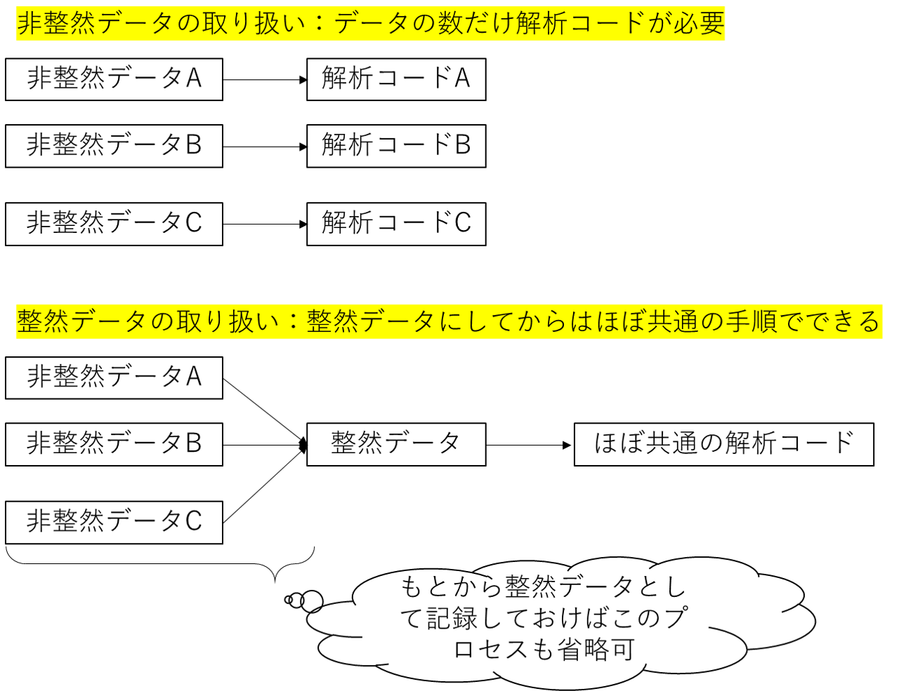

7日目：整然データを用いた解析の手順
-----------------------------------

いったんデータを整然形式にしてしまえばあとはこっちのものです。tidyverseで用意されているさまざまな関数を使ってデータの加工、サマリーの作成、解析などを行っていきましょう。

6日目まででこれだけ苦労してデータを整然データに変換したのはなぜか？それは、この日（７日目）のためです。データをいったん同じような形式＝整然データに揃えてしまうことで、「整然データに至るまでのプロセスは様々」だけど「整然データに至ってからの解析は同じ」になります（下図）。一方で、「非整然データ」を使って直接解析まで持ち込もうとすると「解析の手順はデータによって様々」となり、データや研究テーマが違うごとに異なるコードを書く必要が出てきます。さらに、データをもともと整然データで整理しておけば、データを整然データに直す手順も省略することができます。

では、整然データをとったあとの「おきまりの解析の手順」ってどんなものでしょうか？そんな多くはありません。考えつくのは、下のような感じでしょうか。

1.  データの全体像を把握する: `dplyr::summarize`
    -   得られている変数の範囲や観測値の頻度、値の分布なんかを把握します
2.  解析に用いるデータを抜き出す、並び替える：`dplyr::filter`、`dplyr::arrange`
    -   1で確認した値の分布から、外れ値・異常値と思われるデータを解析から除外します
    -   時空間データなんかを扱う場合には、解析の対象とする範囲のみにデータを絞ったりすることもあります
3.  データを変換したり、別のデータをくっつけたりする：`dplyr::mutate`,
    `dplyr::left_join`, `dplyr::right_join`
    -   応答変数を変数変換したり、説明変数をカテゴリ化したりするときに新たな列を追加します
    -   別のソースから得られたデータをくっつけて、説明変数として用いる（たとえばCPUEデータに、衛星から得られた水温情報をくっつけるなど）
4.  データを可視化し、統計モデルのイメージをつかむ（`ggplot`）
5.  統計モデルを適用し、パラメータ推定する
6.  結果を要約し、見やすい表を作る：`tidyr::pivot_wider`

4のggplotを使った可視化については８日目にします。今回は、1-3のプロセスで必要になるパッケージ`dplyr`の代表的な関数と使用例を紹介します。（私の体感による）使用頻度順です。

### 特定の条件にマッチするデータを抜き出す：`dplyr::filter`（とにかくよく使う）

解析から外れ値を除いたり、解析の範囲を狭めたりする場合などに使います。ここでは、(1)
tidyverseを使わず裸のRでやる場合から、(2)
普通にdplyr::filter関数を使う場合、(3)
それに加えてパイプ`%>%`を使う場合、とちょっとづつ変えています。

    # (1) 裸のRを用いる場合
    data1_areaA <- data1_long[data1_long$area=="A", ]

    # (2) data1_longからA地点のデータのみを抜き出す場合
    data1_areaA <- dplyr::filter(data1_long, area=="A")

    # (3) data1_longからA地点のデータのみを抜き出す場合(%>%)を使って
    data1_areaA <- data1_long %>%
                     dplyr::filter(area=="A")

一押しの書き方はtidyverseを使いつつパイプ`%>%`も使う(3)の書き方になりますが、(1)から(2)、(2)から(3)へは何がそんなに「良く」なっているんでしょうか？

**裸のR(1)からtidyverse(2)へ：**
なんといっても説明が楽ですね。例えば、(1)のコードの意味を人に説明してくれと言われて、どう説明します？　説明するためには、関数でない記号`[]`,
`$`の意味をまずわからいといけないです。そのうえで、データの列のところ（？かっこの左側）に条件式を入れて、それが`c(TRUE, FALSE, ... )`のベクトルになるので、条件式にマッチする行が取り出される、、、というような、、、。Rを使い慣れている人には当たり前のことでも、初修者にはかなり敷居が高いと思います。一方、dplyr::filterであれば、「特定の条件にマッチする行を取り出すには関数dplyr::filterを使います。使い方はdplyr::filter(データ,
条件式)です。」と説明でき、シンプルです。

**(2)から(3)へ**
とくにdplyrで提供される基本関数において、一番目にとる引数（第一引数）は（tidyな）データフレームであることが想定されているような感じです。第二引数以降は条件の様々な設定になります。さらに、関数の返り値もtidy形式になっていることが多いので、**データ1→関数→データ2→関数→データ3**、と数珠繋ぎでコードを書いていくことになります。そのため、`%>%`を使って、**データ1→関数`%>%`関数`%>%`→データ3**
とすれば、関数の間に中間的に生成されていたデータ２を省略することができます。

### 新しい列を付け足す：`dplyr::mutate` (これもよく使う)

`dplyr::filter`と（体感的に）同じくらいよく使う関数は`dplyr::mutate`（新しい列を足す）です。これも`dplyr::filter`と同じく、第一引数にデータをとって、第二引数以降に条件を入れます。さっきの`dplyr::filter`から続きで書くと以下のようになります。

    # data1_longからA地点のデータのみを抜き出し、新しい変数（log_CPUE）を付け足す
    # mutateを使う場合
    data1_areaA <- data1_long %>%
                     dplyr::filter(area=="A") %>%
                     dplyr::mutate(log_CPUE = log(CPUE))

`dplyr::filter`でも`dplyr::mutate`でも、第二引数で登場する`area`、`CPUE`は、与えたデータの列名です。列名の場合にはダブルクォーテーションはつけません。

### 特定の列だけを取り出す：`dplyr::select` (たまに使う)

特定の列だけを選ぶ関数です。たとえば、上では新しい変数`log_CPUE`を作ったので、CPUEの列は不要です。そこで、以下の例のように`select(-CPUE)`として、取り除きたい列名を指定すると、その列が取り除かれます。マイナスをつけない場合は、指定された列だけが残ります。

    data1_areaA <- data1_long %>%
                     dplyr::filter(area=="A") %>%
                     dplyr::mutate(log_CPUE = log(CPUE)) %>%
                     dplyr::select(-CPUE) # CPUEを取り除く
                    # dplyr::select(area, year, log_CPUE) # マイナスで指定しない場合

### データの要約統計量などを示す：`dplyr::summarise` (たまに使う)

平均値や分散などの要約統計量を見てみたいときに使います。

    # data1_longのCPUEの平均値と分散を計算する
    data1_long %>% dplyr::summarise(mean_CPUE=mean(CPUE), var_CPUE=var(CPUE))

    # A tibble: 1 x 2
      mean_CPUE var_CPUE
          <dbl>    <dbl>
    1       305  139714.

第二引数は、「新しく作られる列名=ある列に対する処理（mean(CPUE)とか）」を書きます。複数の統計量を計算したい場合には、複数の命令を並べていけばいいです。ただ、上の例は非常に単純な例でそんなに実際的ではありません。`dplyr::summarise`は、実際には、グループ化のための関数`dplyr::group_by`でデータを「グループ化」してから使います。たとえば、平均値と分散を「地点(area)ごと」に計算したい場合は、

    # data1_longのCPUEの平均値と分散を地点ごとに計算する
    data_summary <- data1_long %>%
                      group_by(area) %>% # grouping by area
                      dplyr::summarise(mean_CPUE=mean(CPUE), var_CPUE=var(CPUE)) # calculate statistics

こんな感じです。これを裸のRを使ってやる場合には、関数`tapply`を使います。ただ、平均と分散の両方について２回書いてから並べないといけないので、ちょっと面倒くさいです。

    # 裸のRの場合
    data1_long0 <- data.frame(mean_CPUE=tapply(data1_long$CPUE,data1_long$area,mean),
               var_CPUE=tapply(data1_long$CPUE,data1_long$area,var))

ただ、`dplyr::summarise`も超絶便利というわけではなく、summaryするための関数（上の例でいうと`mean`とか`var`とか）の返り値は一つでないといけないという制約があります。なので、`quantile(probs=c(0.05,0.5,0.95))`とかは使えません（ただし、dplyr1.00からは使えるようになるらしいです。
<a href="https://www.tidyverse.org/blog/2020/03/dplyr-1-0-0-summarise/" class="uri">https://www.tidyverse.org/blog/2020/03/dplyr-1-0-0-summarise/</a>
。残念ながらまだ私の環境下ではinstall\_githubに失敗して試せていません）。

### 別のデータフレームをくっつける：`dplyr::left_join`,`dplyr::right_join`など`dplyr::XXX_join`という関数（使うのはたまにだけど、重要）

さいご、そんなに頻繁には使いませんが、これを知っているとすごく便利な`left_join`,`right_join`など`XXX_join`という関数を紹介します。これは、
**２つのデータをセットをマッチングしてくっつける**
働きをします。裸のRでは`merge`という関数に相当します。

たとえば、地点Aと地点Bの緯度・経度のデータが以下のように`data_lonlat`というデータセットにあったとします。CPUEを記録した`data1_long`のデータセットの解析のさい、場所情報は地点は名前でなく、その地点の緯度・経度の情報として使っていきたい場合があります。そのさい、２つのデータを以下のようにくっつけます。

    # 地点の緯度経度を示す別のデータセット
    data_lonlat <- tibble(area=c("地点A","地点B"),
                          longitude=c(150,170),
                          latitude=c(45,51))

    # left_joinでくっつける
    data1_long <- data1_long %>%
                    left_join(data_lonlat) %>%
                    print()

    # A tibble: 8 x 5
      area  year   CPUE longitude latitude
      <chr> <chr> <dbl>     <dbl>    <dbl>
    1 地点A 2010   1000       150       45
    2 地点A 2011    720       150       45
    3 地点A 2012    420       150       45
    4 地点A 2013    100       150       45
    5 地点B 2010    120       170       51
    6 地点B 2011     50       170       51
    7 地点B 2012     20       170       51
    8 地点B 2013     10       170       51

そうすると、CPUEデータの地点A、地点Bに対応した緯度経度が新しい列として加わりました。left,
rightの違いは、left\_joinの場合には左側のデータに右のデータをくっつける、right\_joinはその逆です。あと、いろいろinnner\_joinとかありますが、そのあたりは適当にググってください。

### まとめ

今回はデータを解析する前に整理する関数を紹介しました。普段は、どの関数がどのパッケージに属しているかなんて気にせずに使っているんですが（`library(tidyverse)`とすれば`dplyr::`とかつける必要はないので）、今回それを明示的に書くためにいろいろ調べたら、データ整理のための関数は`dplyr`にほとんどまとめられているということに気づきました（遅い）。一方、データを縦横変換する関数は`tidyr`ですね。

なのでデータ解析の手順とパッケージは

-   tidyrでデータを横縦変換してtidy dataに
-   dplyrでデータ整理
-   ggplotでデータの可視化
-   いろんな統計ツールで解析
-   tidyrでデータを縦横返還して結果をまとめる

こんな感じで対応していて、tidyrで始まってtidyrで終わるんだなと関心しました。

ということで、次は、tidyverseで使われる可視化パッケージggplotについてご紹介します。
