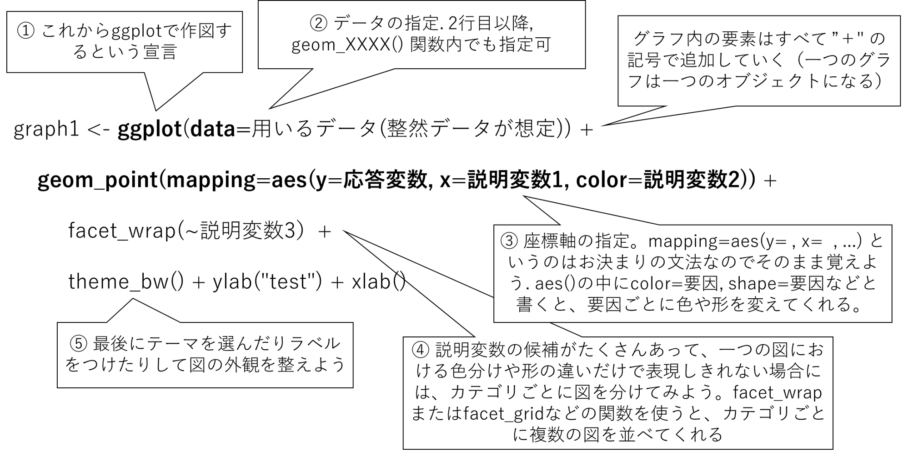

```{r, echo=FALSE}
library(knitr)
library(rmarkdown)
library(tidyverse, quietly = TRUE)
#render("text.Rmd")

## Global options
options(max.print="75")
opts_chunk$set(echo=TRUE,
#                     cache=TRUE,
               prompt=FALSE,
               tidy=FALSE,
               comment=NA,
               message=FALSE,
               warning=FALSE)
opts_knit$set(width=75)
par(mar=c(4,4,3,1))
```

## 8回目：とうとうggplot

tidyverse連載もとうとう8日目、2周目に突入しました。1週目はtidyverseのインストールとtidyverseに含まれる様々なパッケージの紹介、記号`::`や`%>%`の紹介、そして整然データ(tidy data)の概念について勉強しました。2周目は、tidyverseの中でも特に大きなコンポーネントであるグラフィクスパッケージ、ggplot2の特徴について解説したあと、ループ処理のpurrrなどのパッケージについて紹介します。また、実例データを使った解析例などもあるかも。

### ggplotを使うときの心構え

さて、今回はggplotの話になりますが、みなさん、ggplotを使ったことありますか？Rを勉強し始めるとき、いきなりggplotから使い始めた、ggplotが当たり前という人は多くいらっしると思います。一方、長年Rを使ってきて、通常のRのグラフィックスソフトの使い方が馴染んでしまっていて、なかなかggplotに移行できないという人も多いのではないでしょうか。私もそうでした。

tidyverseで提供される他のパッケージについては、「普通のRよりもちょっと便利」といった感じで、普通のRの延長線上みたいな位置づけっぽいんですが、グラフィックスパッケージtidyverseに限っては、かなり・全く考え方が違います。その考え方を理解しないで、ちょっと便利なパッケージを使ってみよう、くらいの意識では途中で挫折してしまいます。私もそうでした。

そこで、ここではまず普通のRにおける作図と、ggplotにおける作図の考え方の違いを以下に整理しました。これによって、ggplotを使うぞ・覚えるぞ、という意識をまず高めていきましょう（既にggplotを知っている人は飛ばしても大丈夫です）。

:star: ggplotを使うときの心構え :star:

- tidyなデータ・セットを用意しておく：ggplotは整然データの可視化を想定して作られたパッケージです。7日目に解説したdplyrと同じように、整然データをまず用意することがggplotの必須条件です。
- ある程度、新しい関数名・用語は覚える必要がある（または毎回ググる覚悟を決める）：`aes`、`coord_cartesian`、`theme`など、普通のR関数からは内容を想像できない新しい用語が出てきます。このあたりはある程度新しく覚える覚悟が必要です。または頭文字だけ覚えてRstduioに補完してもらう、[チートシート](https://rstudio.com/wp-content/uploads/2015/03/ggplot2-cheatsheet.pdf)を常に傍らにおいておくなどの方法も使ってください。

では、心構えができたところで、ggplotについて勉強していきましょう。

### ggplot2の概要

ggplot2は整然データと親和性の高い作図関数を提供するパッケージで、これもtidyverseの中に含まれます。ggplot2の特徴はなんといっても、「美しい」「見栄えが良い」「効率的」「拡張性が高い」など魅力的な言葉が帰ってきます。効率的に美しいグラフが作成できるなんて夢のような話ですが、なぜそんなことが可能なのでしょうか？

先に書いたように、ggplotでは、作図に用いるデータは整然データ形式になっていることが前提で設計されています。そのため、データが整然データでありさえすれば、あとは**お決まりの手順、かつ、実際にデータを統計解析にかけるようなイメージで**グラフを作成できるようになっています（`dplyr`のときもそうでしたね）。効率的というのはその点にあります。また、「美しさ」「見栄え」は、ggplotがグラフィックの構成要素を重ね書きするレイヤー構造を意識して作られているためです。ggplotを書くとき、すべての作図の命令は`+`で繋がれます。つまり、作図プログラムは「一行で」書かれます。これにより、パソコン（R）側は最終的に取り込むべきグラフの要素がどんなものか、把握した上でプロットを作成できるようになります。そのため、通常のRでありがちな、「グラフの要素をどんどん足していったら、ラベルやタイトルが図に重なって見栄えが悪くなる」ような現象を最小限に抑えることができます
ちなみに、ggplotは、Wickham (2010) の"grammer of graphics (作図のための文法)"に沿って作られており、ggplotのggはgrammer of graphicsの略になります。

まず、ここでは簡単に、ggplotではどのような考え方で作図がなされるかを解説します。ggplotを用いた作図のプログラミングは、さきに述べたように「実際にデータを統計解析にかけるようなイメージで」実施していくと考えやすいです。

通常、データ解析は

- どのデータを使うか？
- 候補となる説明変数の変化に対して、応答変数はどのように変化しているか？また、応答変数は説明変数のカテゴリーによってどのように変わるか？

ことを調べるのが基本的な流れです。そこで、統計解析のための作図は、多くの場合、**応答変数をy軸にとり、候補となる複数の説明変数をx軸にとって両者の関係性を可視化**するような図となります。さらに、説明変数が連続変数でなくカテゴリカル変数であったり、複数ある場合には、**yとxの関係を要素ごとに色分けしたり、別の図に分けて書いたりします**。

つまり、データ解析は下記の1)〜3)のような手順が想定されます。そしてそれは図1で示したggplotの基本的な文法のちょうど1〜3行目に対応します。

1) 使用する整然データを宣言する（図1の①②の手順に対応）。図では1パターンだけ示しましたが、以下のようにいくつかのパターンで指定が可能です。ウェブサイトやマニュアルによって書き方の好みがあるようですが、同じことです。
    - `ggplot(data=使うデータ)` : 図1と同じ。基本形？ 
    -  `使うデータ %>% ggplot() + ... `：パイプをよく使う人の場合はこちらが基本的に使われるかも。
    - `ggplot() + geom_point(data=使うデータ)` ：複数のデータ・セットを重ね書きする場合
2) 応答変数をy軸に指定（図1の③の手順に対応）; `geom_point`関数内で`maping=aes(y=応答変数)`
    - `geom_何とか`という関数が、通常のRの`plot`、`matplot`、`barplot`などの種類別のグラフを指定する関数になります。`geom_何とか`にはたいてい、`mapping=aes(y=応答変数, x=説明変数)`という書式で、x軸とy軸にプロットする用をを指定することになります。そうでないものもありますが、そういう場合は[チートシート](https://rstudio.com/wp-content/uploads/2015/03/ggplot2-cheatsheet.pdf)をみながらやっていきましょう。
3) 説明変数はx軸にしたり、色分けしたり、別の図として並べたりしてyに対する影響を見る（図1の③④の手順に対応）
    - 説明変数の候補がもっとある場合、`aes(color=説明変数2, shape=説明変数3, lty=説明変数4)`みたいに、色別・形別・線種別など、説明変数によって種類を変えていきます。
    - 1枚の図に入り切らない場合には、`facet_wrap`または`facet_grid`を使って要素ごとに図を分けます

### ggplotを用いた作図文法の基本




