8回目：とうとうggplot
---------------------

tidyverse連載もとうとう8日目、2周目に突入しました。1週目はtidyverseのインストールとtidyverseに含まれる様々なパッケージの紹介、記号`::`や`%>%`の紹介、そして整然データ(tidy
data)の概念について勉強しました。2周目は、tidyverseの中でも特に大きなコンポーネントであるグラフィクスパッケージ、ggplot2の特徴について解説したあと、ループ処理のpurrrなどのパッケージについて紹介します。また、実例データを使った解析例などもあるかも。

### ggplotを使うときの心構え

さて、今回はggplotの話になりますが、みなさん、ggplotを使ったことありますか？Rを勉強し始めるとき、いきなりggplotから使い始めた、ggplotが当たり前という人は多くいらっしると思います。一方、長年Rを使ってきて、通常のRのグラフィックスソフトの使い方が馴染んでしまっていて、なかなかggplotに移行できないという人も多いのではないでしょうか。私もそうでした。

tidyverseで提供される他のパッケージについては、「普通のRよりもちょっと便利」といった感じで、普通のRの延長線上みたいな感じで使えることが多いんですが、グラフィックスパッケージggplotに限っては、かなり・全く考え方が違います。なので、ちょっと便利なパッケージを使ってみよう、くらいの意識では途中で挫折してしまいます。私もそうでした。

そこで、ここではまずggplotを使うときの心構えを2つ挙げます。これによって、ggplotを使うぞ・覚えるぞ、という意識をまず高めていきましょう（既にggplotを知っている人は飛ばしても大丈夫です）。

:star: ggplotを使うときの心構え :star:

-   作図の前にtidyなデータ・セットを用意しておく必要がある：ggplotは整然データの可視化を想定して作られたパッケージです。7日目に解説したdplyrと同じように、整然データをまず用意することがggplotの必須条件です。
-   ある程度、新しい関数名・用語は覚える必要がある（または毎回ググる覚悟を決める）：`aes`、`coord_cartesian`、`theme`など、普通のR関数からは内容を想像できない新しい用語が出てきます。このあたりはある程度新しく覚える覚悟が必要です。または頭文字だけ覚えてRstduioに補完してもらう、[チートシート](https://rstudio.com/wp-content/uploads/2015/03/ggplot2-cheatsheet.pdf)を常に傍らにおいておくなどの方法も使ってください。

では、心構えができたところで、ggplotについて勉強していきましょう。

### ggplot2の概要

ggplot2は整然データと親和性の高い作図関数を提供するパッケージで、これもtidyverseの中に含まれます。ggplot2の特徴はなんといっても、「美しい」「見栄えが良い」「効率的」「拡張性が高い」など魅力的な言葉が帰ってきます。効率的に美しいグラフが作成できるなんて夢のような話ですが、なぜそんなことが可能なのでしょうか？

先に書いたように、ggplotでは、作図に用いるデータは整然データ形式になっていることが前提で設計されています。そのため、データが整然データでありさえすれば、あとは**お決まりの手順、かつ、実際にデータを統計解析にかけるようなイメージで**グラフを作成できるようになっています（`dplyr`のときもそうでしたね）。効率的というのはその点にあります。（逆に、整然データでないデータをいきなりggplotにかけようとするとわけがわからなくなって、ggplotの良さを発揮することができません。）

また、「美しさ」「見栄え」は、ggplotがグラフィックの構成要素を重ね書きするレイヤー構造を意識して作られているためです。ggplotを書くとき、すべての作図の命令は`+`で繋がれます。つまり、**作図プログラムは「一行で」書かれます**。これにより、パソコン（R）側は最終的に取り込むべきグラフの要素がどんなものか、全部を把握した上で作図できます。そのため、通常のRでありがちな、「グラフの要素をどんどん足していったら、ラベルやタイトルが図に重なって見栄えが悪くなる」ような現象を最小限に抑えることができます。（ちなみに、ggplotは、作図するための統一的な文法構造を提案した
Wickham (2010) の“grammer of graphics
(作図のための文法)”に沿って作られており、ggplotのggはgrammer of
graphicsの略になります。）

まず、ここでは簡単に、ggplotではどのような考え方で作図がなされるかを解説します。ggplotを用いた作図のプログラミングは、さきに述べたように「実際にデータを統計解析にかけるようなイメージで」実施していくと考えやすいです。

通常、データ解析は

-   どのデータを使うか？
-   候補となる説明変数の変化に対して、応答変数はどのように変化しているか？また、応答変数は説明変数のカテゴリーによってどのように変わるか？

ことを調べるのが基本的な流れです。そのため、統計解析のための作図は、多くの場合、**長さが揃ったデータフレームをもとに**、**応答変数をy軸にとり、候補となる複数の説明変数をx軸にとって両者の関係性を可視化**するような図となります。さらに、説明変数が連続変数でなくカテゴリカル変数であったり、複数ある場合には、**yとxの関係を要素ごとに色分けしたり、別の図に分けて書いたりします**。

つまり、データ解析は下記の1)〜3)のような手順が想定されます。そしてそれは図1で示したggplotの基本的な文法のちょうど1〜3行目に対応します。

1.  使用する整然データを宣言する（図1の①②の手順に対応）。図では1パターンだけ示しましたが、以下のようにいくつかのパターンで指定が可能です。ウェブサイトやマニュアルによって書き方の好みがあるようですが、みんな同じことです。
    -   `ggplot(data=使うデータ)` : 図1と同じ。基本形？
    -   `使うデータ %>% ggplot() + ...`：パイプをよく使う人の場合はこちらが基本的に使われるかも。
    -   `ggplot() + geom_point(data=使うデータ)`
        ：複数のデータ・セットを重ね書きする場合
2.  応答変数をy軸に指定（図1の③の手順に対応）;
    `geom_point`関数内で`maping=aes(y=応答変数)`
    -   `geom_何とか`という関数が、通常のRの`plot`、`matplot`、`barplot`などの種類別のグラフを指定する関数になります。`geom_何とか`にはたいてい、`mapping=aes(y=応答変数, x=説明変数)`という書式で、x軸とy軸にプロットする用をを指定することになります。そうでないものもありますが、そういう場合は[チートシート](https://rstudio.com/wp-content/uploads/2015/03/ggplot2-cheatsheet.pdf)をみながらやっていきましょう。
3.  説明変数はx軸にしたり、色分けしたり、別の図として並べたりしてyに対する影響を見る（図1の③④の手順に対応）
    -   説明変数の候補がもっとある場合、`aes(color=説明変数2, shape=説明変数3, lty=説明変数4)`みたいに、色別・形別・線種別など、説明変数によって種類を変えていきます。
    -   1枚の図に入り切らない場合には、`facet_wrap`または`facet_grid`を使って要素ごとに図を分けます

### ggplotを用いた作図文法の基本

コード例
--------

ぐだぐた説明を書きましたが、習うより慣れろということで、とりあえずデータをプロットするところを実習してみましょう。

まず例データを作成します。ここでは、できるだけ身近な例ということで、年(year)、海域（area)、水温(temp)ごとに記録されたlog\_CPUEデータがあると想像しています。

    library(tidyverse)
    # 例データの作成
    n_sample <- 500
    data_example <- tibble(Year=sample(2010:2019,n_sample,replace=TRUE),
                           Area=factor(sample(str_c("Area",1:5),n_sample,replace=TRUE)),
                   Temp=runif(n_sample,0,30)) %>%
            mutate(log_CPUE=(-0.05)*Year-0.005*(Temp)^2+0.15*Temp+1.2*as.numeric(Area)+100) %>%
            mutate(log_CPUE=log_CPUE+rnorm(n_sample,0,0.3)) %>%
            mutate(CPUE = exp(log_CPUE))

CPUE、年、海域、水温のデータがあるので、想定されていることはCPUEの標準化です。ここでは標準化の前にデータの傾向を知るためにggplotでプロットしていきますので、想定される応答変数はCPUE、説明変数の候補は年、海域、水温ですね。ですので、応答変数を指定するところ`aes(y=...)`は`aes(y=CPUE)`となります。説明変数は、例えば横軸に年を取る場合には`aes(y=CPUE, x=year)`と続きます。また、プロットのタイプとしてはまず散布図を示す`geom_point`を使いましょう。すると以下のようにプロットできます。また、ggplotの結果はオブジェクトとして返されて値に入れて保存することができるので、ここでは、作ったグラフを`g1`というオブジェクトに保存し、保存したあとでprint(g1)としてプロット結果を見ています。

    g1 <- data_example %>% ggplot() +
      geom_point(aes(y=CPUE, x=Year))
    g1  

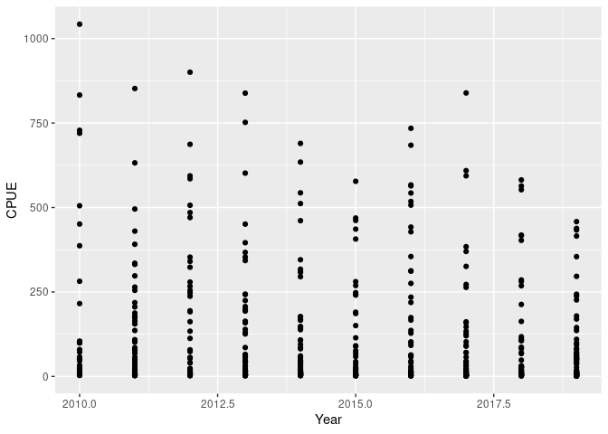

ちなみに通常のRを使う場合は

    plot(CPUE~Year,data=data_example)

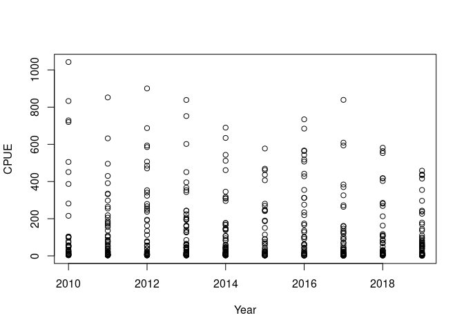

ですね。この時点では通常のRのほうがきれいだ（あと見慣れている）しプロットのコードも簡単じゃん、と思われるかもしれませんが、このあとggplotはもっときれいに、コードも簡単になっていきます。

### 見栄えを良くする : `theme_何とか()`を足す

まず、見栄えがよくないとグラフを作るモチベーションが出てこないので、見栄えを調整します。そのためには、`theme_何とか()`という関数をggplotの記述に足します。たとえば、背景が白でよりシンプルな`theme_bw`を足すと、見栄えが変わります。ここではフォントサイズも`base_size`引数を使ってで少し変えています。

    g1 <- data_example %>% ggplot() +
      geom_point(aes(y=CPUE, x=Year)) +
      theme_bw(base_size=18)
    g1

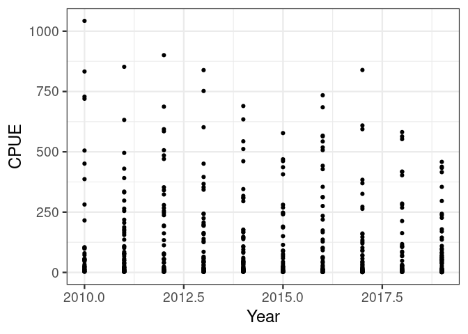

プロットに関数全体のテーマを設定する関数はいろいろ用意されており、`theme_bw`のほかに、`theme_dark`や`theme_classic`などあります。これらも試してみましょう。ここで、ggplotの便利なところですが、さきに作成したグラフオブジェクト`g1`を再利用することができます。つまり、g1に、上書き設定したいコードを`+`で追加することで、中身は同じままで、追加されたコード分が上書きされたグラフを得ることができます。たとえば先程作成した`g1`オブジェクトに別のテーマを上書きします。

    # theme_dark() を試す
    g1 + theme_dark(base_size=18)

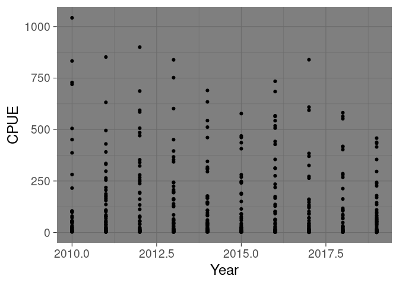

    # theme_classic() を試す
    g1 + theme_classic(base_size=18)

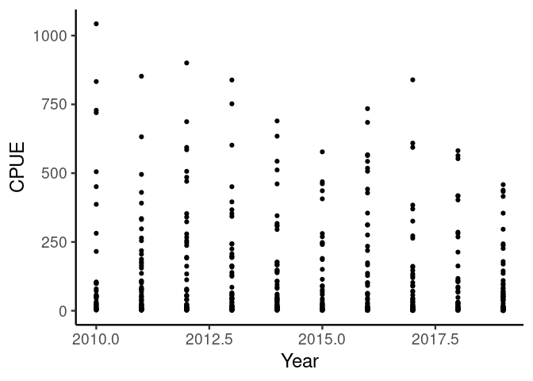

また、frasyrでも`theme_SH()`というテーマを配布しています。これはフォントの大きさ、軸の太さ等を資源評価報告書用に最適化したものです。

    # frasyrで配布している資源評価報告書用のテーマ
    g1 + frasyr::theme_SH()

frasyrのプロット関数は基本的に`theme_SH()`が適用されているので、frasyrで作ったグラフを自分流にアレンジしたい場合は、作成されたグラフオブジェクトに自分の好きなthemeを足して設定を上書きしていただければアレンジ可能です。また、自作のグラフ関数に`+ frasyr::theme_SH()`を足せば、資源評価報告書用のテーマを適用できます。

ggplotのオブジェクトでは`theme`に限らず、多くの要素を上書きすることができます。例えば、横軸と縦軸のラベルや範囲などもカスタマイズ可能です。なので**frasyrで作成されたグラフオブジェクト（ggplotのものに限りますが）の細かい調整が必要な場合、frasyrを変更しないでも、自分でできる場合があるので、ぜひやってみてください。**　特に魚種によって、年のラベルを「年」にするのか、「漁期年」にするのか、y軸の単位などが異なりますので、、。ただ複雑な要素が組み合わさったグラフオブジェクトについてはカスタマイズしようとしても思い通りの結果が得られないことがありますので、その場合はissueに要望を投稿してください。

    # ラベルを変更する
    g1 + frasyr::theme_SH() + xlab("Fishing year") + ylab("CPUE of chub mackerel (kg/net)")

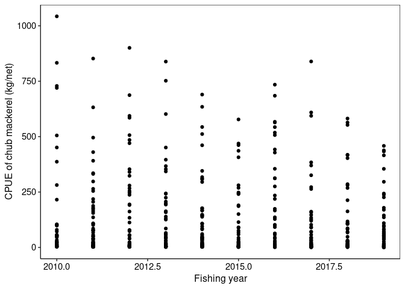

    # 縦軸の範囲を変更する
    g1 + frasyr::theme_SH() + coord_cartesian(ylim=c(0,500))

### データ探索 : 説明要因ごとに色分けしたり図を変えたりする

ちょっと脇道にそれましたが、本題の、ggplotを使ったデータ探索を勧めましょう。さきほどは、y軸にCPUEを、x軸に年をとってみましたが、これだけだとデータがばらついていてどんな傾向があるのかわかりません。年以外の説明変数としては水温と海域が利用できるので、たとえばまず、海域ごとに色を変えてみましょう。要素ごとに色を分けるには、`aes`の中に`color=Area`を追記します。

    data_example %>% ggplot() +
      geom_point(aes(y=CPUE, x=Year, color=Area)) +
      theme_bw(base_size=18)

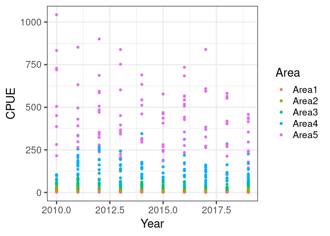

プロットの形も同時に変えたい場合には、`shape=Area`も足します。

    data_example %>% ggplot() +
      geom_point(aes(y=CPUE, x=Year, color=Area, shape=Area)) +
      theme_bw(base_size=18)

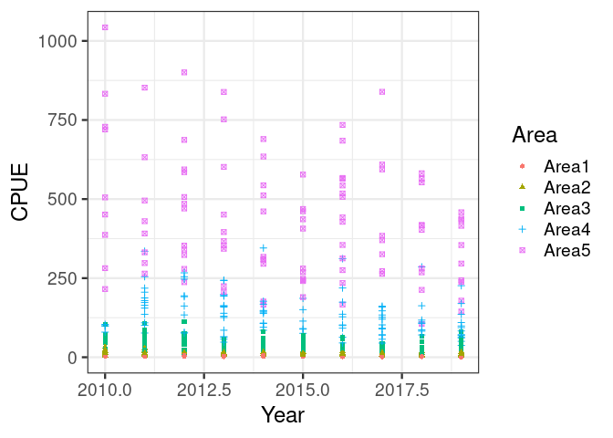

このように要因によって色や形を変えると、なんとなく傾向が見えてきますね。海域１〜５に行くに従ってCPUEが平均的に大きくなるようなパターンになっていて、また、海域ごとに見ると年によってCPUEは減少しているように見えます。

次は箱型図でCPUEの変化を見てみましょう。これは`geom_point`（散布図）を`geom_boxplot`（箱型図）に変え、また、x軸はカテゴリ変数しか使えないので`x=factor(Year)`とします。`color=Area, shape=Area`はそのままでかまわないようです。

    data_example %>% ggplot() +
      geom_boxplot(aes(y=CPUE, x=factor(Year), color=Area, shape=Area)) +
      theme_bw(base_size=18)

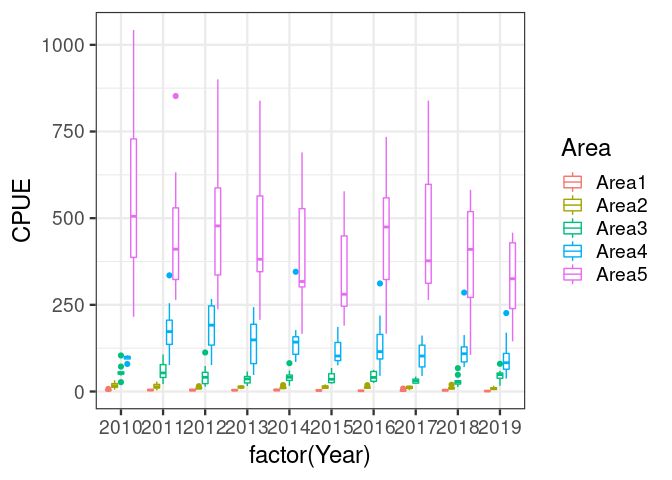

箱型図にすると海域間の分布の違いがよりはっきりします。

ただ、まだこれでも、海域１と５の間でCPUEの差が大きすぎて、海域１のトレンドがどうなっているかよくわかりません。そこで、CPUEを海域ごとに**別の図として**プロットします。そのときは`facet_wrap()`を足します。するとこうなります。

    data_example %>% ggplot() +
      geom_boxplot(aes(y=CPUE, x=factor(Year), color=Area, shape=Area)) +
      facet_wrap(.~Area) + # Area別に図を分ける
      theme_bw(base_size=18)

そのままだと、すべての図でy軸の範囲が同じになるので、CPUEの平均値が異なる海域別にトレンドを見たいという目的が果たされません。そこで、y軸のスケールを図によって変えるオプション
`scale="free_y"`を追加します。また、CPUEの解析では、y軸の最小値が０になっていたほうが良いので、y軸の最小値を０とする設定（`ylim(0,NA)`）も加えました。さらにｘ軸のラベルが重なっているので、それを９０度回転させています。

    data_example %>% ggplot() +
      geom_boxplot(aes(y=CPUE, x=factor(Year), color=Area, shape=Area)) +
      facet_wrap(.~Area, scale="free_y") + # 図によってy軸の範囲を変える
      theme_bw(base_size=18) +
      ylim(0,NA)　+ # 最小値をゼロにする
      theme(axis.text.x=element_text(angle = 90)) # 軸のラベルを回転する

これでほぼ論文に載せられる図の完成です！通常のRを使ってこのような図を書く場合には、データを海域で分割してそれをforループで回して複数の図を書くというプロセスになりますが、それと比べるとggplotは格段にやりやすいことがわかると思います。

データ処理と組み合わせる
------------------------

では次にtidyデータをdplyrで処理しながらプロットしていく例を見ましょう。例データの中で、水温TempとCPUEの関係を見ると（`aes(x=Year)`を`aes(x=Temp)`に変えます）、、

    data_example %>% ggplot() +
      geom_point(aes(y=CPUE, x=Temp, color=Area)) +
      theme_bw(base_size=18) +
      ylim(0,NA)　 # 最小値をゼロにする

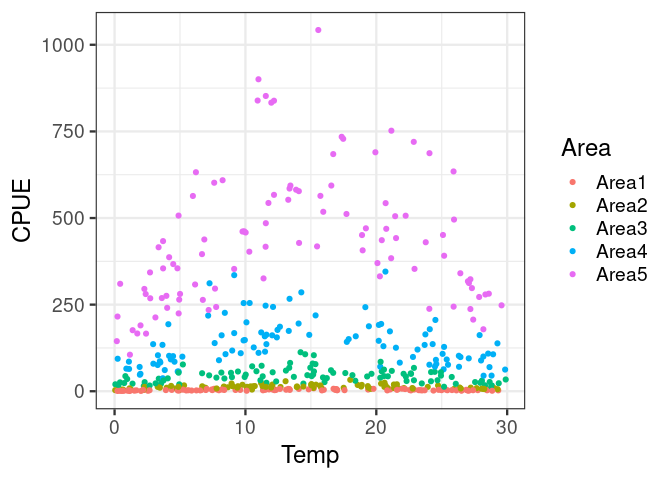

となります。海域によってCPUEに差があるので、水温が影響しているのかどうかよくわかりません。そこで、やはりfacet\_wrapを使って海域ごとに水温とCPUEの関係をプロットすると、水温とCPUEの関係が明瞭にわかってきます。

    data_example %>% ggplot() +
      geom_point(aes(y=CPUE, x=Temp, color=Area)) +
      facet_wrap(.~Area, scale="free_y") + 
      theme_bw(base_size=18) +
      ylim(0,NA)　 # 最小値をゼロにする

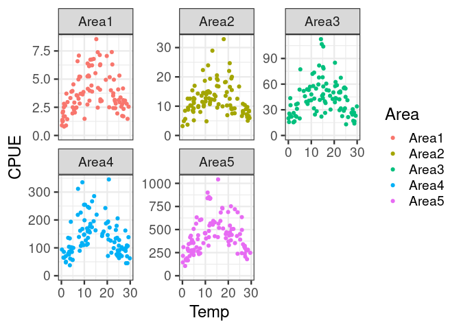

どの海域でも15度くらいで一番CPUEが大きくなる傾向にあるようです。

結局、CPUEには水温も海域も影響しているのでそれを一つの図で可視化したい、、。例えばこんあ図なんてどうでしょうか？水温は連続変数ですが、上図から、10度以下、20度以上でCPUEが低く、10-20度でCPUEた高い傾向にあることがわかったので、変数Tempを３つのカテゴリ(Temp\_category)に分けます。そして、Temp\_categoryごとに色を変えて年ごとの箱型図にして、海域別の図にします。そうすると、海域間でCPUEのレベルに違いはあるものの、共通して10〜20度のカテゴリでCPUEは高い傾向にあり、しかし、同じ水温・海域のカテゴリ内で見ると年に対してCPUEが減少している傾向にあることがわかると思います。

Rコードでは、data\_examleをパイプでggplotに渡す前に
`mutate`関数を使って新しいカテゴリ`Temp_category`を作成し、その結果のデータをggplotに入れ、新しく作成した`Temp_category`ごとに箱型図の色を塗り分けています（\`aes(fill=Temp\_category)）。

    data_example %>% mutate(Temp_category=case_when(Temp<10~"T00-10",
                                                    Temp>10 & Temp<20~"T10-20",
                            Temp>20~"T20-30")) %>%
             mutate(Year = factor(Year)) %>%
         ggplot() +
           geom_boxplot(aes(y=CPUE, x=Year, fill=Temp_category)) +
           facet_wrap(.~Area, scale="free_y") +
           theme_bw(base_size=18) +
           theme(legend.position="top")+
           ylim(0,NA)　 # 最小値をゼロにする

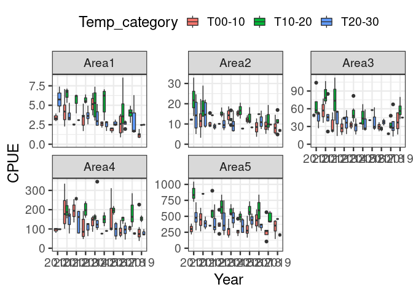

### まとめ

思いがけず長くなってしまいましたがggplotを使うといい感じの図がすぐに作れるようになるので、ぜひ頑張って勉強してみてください。繰り返しになりますがポイントは

-   出来上がりをある程度イメージした整然データをまず用意する（凡例やfacet\_wrapしたときのタイトルは列名がそのまま使われるので、列名もそのままグラフで表示できるように定義しておいたほうが後々楽です（例：漁期年なら`fyear`でなく`Fishing_year`とするなど）
-   基本的な流れ（`data %>% ggplot() + geom_point(aes(y=y, x=x))`）とある程度の関数（`theme_bw(), facet_wrap()`）は頑張って覚える。残りはググる。
-   作成されたグラフオブジェクトは、細かい設定の上書き可能。fraysrなどのパッケージで作成されたグラフでも、手元で微調整できる（軸名を変えたりタイトルを追加したり）

です。ではでは。
