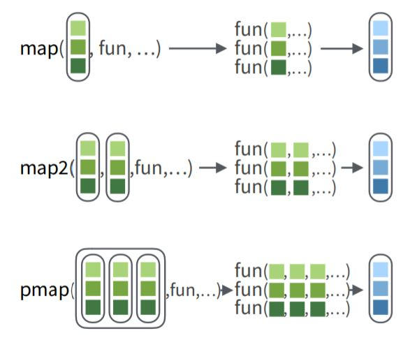
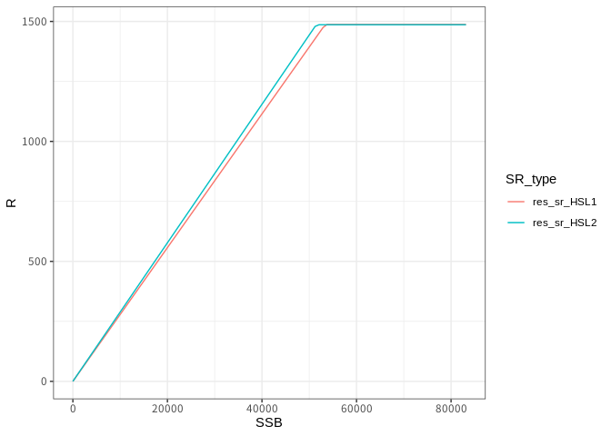

9回目：purrr〜もうforは使わない〜
---------------------------------

第９回目はtidyverseの中のパッケージの一つpurrrで提供されるさまざまな`purrr::map_何とか`の関数について解説します。purrrは、通常のRにおけるapply系の関数forループに代わる機能を提供します。purrrについてはいろいろ便利な機能があるようですが、私も代表的なものしか使ったことがないので、知っている範囲で解説します。網羅的な機能の一覧は[chetsheet](https://github.com/rstudio/cheatsheets/raw/master/purrr.pdf)を見るとわかりやすいと思います。

### map系関数の基本

map系関数の基本は、`purrr::map_何とか(リスト, 関数)`という形になります。これによって、リストの中の各要素に一括して関数を適用することができます。図であらわすとこんなかんじ（cheatsheetからの引用）です。

コードの単純な例として、こんなリスト

    example_list <- list(a=rnorm(19), b=runif(10), c=1:5)
    example_list

    $a
     [1] -0.28643090  0.32660099 -0.21223171 -1.56175602  0.48832959 -0.92554522
     [7]  0.15312735 -0.78236846  1.43267004  0.62382626  0.44012850  0.99483423
    [13]  0.36284188 -0.29273791  0.49540622  0.68900156 -0.60665143  0.02742223
    [19] -1.34276106

    $b
     [1] 0.38867172 0.13924729 0.81254407 0.08978912 0.09773777 0.73671789
     [7] 0.37395257 0.96164621 0.38535810 0.27872571

    $c
    [1] 1 2 3 4 5

を考えます。

それぞれのリストの長さも内容も違うのでデータフレームとして扱うことはできません。ただ、それぞれのリストの中のベクトルの平均値が知りたいです。そこで`purrr::map`を使います。

    # example_listの各要素にmean関数を適用
    purrr::map(example_list, mean)

    $a
    [1] 0.001247691

    $b
    [1] 0.426439

    $c
    [1] 3

それにより、example\_listの1, 2,
3番目の要素に関数`mean`が適用された結果をリスト形式で得ることができました。これがmap系関数の基本的動作です。ただ、`purrr::map`をそのまま素朴に使うことはあまりなく、`purrr::map_何とか`という「何とか」と合わせてつかうことが多いです。「何とか」は、mapしたあとの結果を「どのように整形するか」を示します。さきの例では、`mean`の結果はどれも数値になっているので、わざわざリストで返さなくても、数値のベクトルとして返してほしいです。その場合には、`purrr::map_dbl`
(結果をdouble形式のベクトルで返す)を使います。

    # それぞれの要素の平均値を計算
    purrr::map_dbl(example_list, mean)

              a           b           c 
    0.001247691 0.426439044 3.000000000 

この場合は、結果が名前付きのベクトルで返ってきます。同様の挙動を示す仲間はpurrr::map\_lgl(論理値),
purrr::map\_int(整数), purrr::map\_chr(文字列)があります。

さらに、返り値が一つではなくquantileのように複数ある場合には、結果をデータフレーム形式にまとめて返す`purrr::map_dfr`を使います。quantileに渡す引数は、mapの3番目以降の引数として渡します。

    # それぞれの要素の5,50,95パーセンタイルを計算
    purrr::map_dfr(example_list, quantile, probs=c(0.05,0.5,0.95))

    # A tibble: 3 x 3
           a      b     c
       <dbl>  <dbl> <dbl>
    1 -1.36  0.0934   1.2
    2  0.153 0.380    3  
    3  1.04  0.895    4.8

ただこの結果の場合、listの中の要素a, b,
cから出てきた結果がそれぞれ列に並んでいて、どの行が何パーセンタイルになっているかの情報がありません。tidyなデータを目指すなら、行にa,
b,
cの結果が、列にパーセンタイルがあってほしいです。つまり、quantileしたあとの結果をカスタマイズしてからデータフレームとしてくっつけてほしいです。そのような場合、quantileしたあとの結果をデータフレーム化して転置する簡単な関数を書いて、それをmapで使います。そのさい、`map_dfr`の引数.id="新しく作る列名"を指定すると、リストについている各要素の名前が列名で指定された新しい列に格納されます。

    # 関数を自作
    tmpfunc <- function(x) quantile(x, probs=c(0.05,0.5,0.95)) %>%
                               t() %>% as.data.frame()
    # mapを適用
    purrr::map_dfr(example_list, tmpfunc, .id="id")

      id          5%       50%       95%
    1  a -1.36466055 0.1531273 1.0386178
    2  b  0.09336601 0.3796553 0.8945502
    3  c  1.20000000 3.0000000 4.8000000

さらに、いちいち新しい関数に名前をつけるのが大変なので、それを省略した以下のような表現がよく用いられます。

    # mapの中で関数を定義（＝無名関数）
    purrr::map_dfr(example_list,
                   function(x) quantile(x, probs=c(0.05,0.5,0.95)) %>%
                               t() %>% as.data.frame(),
                   .id="id")

      id          5%       50%       95%
    1  a -1.36466055 0.1531273 1.0386178
    2  b  0.09336601 0.3796553 0.8945502
    3  c  1.20000000 3.0000000 4.8000000

    # .の省略形を使う（すべて表現が%>%で繋がっている場合に使える）
    purrr::map_dfr(example_list,
                   . %>% quantile(probs=c(0.05,0.5,0.95)) %>%
                               t() %>% as.data.frame(),
                   .id="id")

      id          5%       50%       95%
    1  a -1.36466055 0.1531273 1.0386178
    2  b  0.09336601 0.3796553 0.8945502
    3  c  1.20000000 3.0000000 4.8000000

自分で作るようになるのには慣れが必要ですので、最初は自前関数を定義→mapで使う、という流れに慣れたら省略形を使っていくのがよいでしょう。function(x)の中身は{}で区切れば何行でもRコードをつなげて書けるので、これがforループのかわりになります。

ちなみに、forループを使って書く場合には

    res <- NULL
    for(i in 1:length(example_list)){
        res <- rbind(res,
                     quantile(example_list[[i]], probs=c(0.05,0.5,0.95)))
    }
    res

                  5%       50%       95%
    [1,] -1.36466055 0.1531273 1.0386178
    [2,]  0.09336601 0.3796553 0.8945502
    [3,]  1.20000000 3.0000000 4.8000000

みたいな感じになります。forにも慣れていない人はまずforから勉強すると良いと思います。g

### map系関数の実践

ただ、リストの要素を平均したりとか、そんな場面なんてそんなに多くないんじゃ？と思う人がいるかもしれません。いやいや、そんなことはありません。

たとえばfraysrなどでもそうですが、シミュレーションをする関数や統計計算の関数の結果はさまざまな要素を持つリスト形式で返ってくることが普通です。ひとつだけの結果を扱う場合には、リスト形式で返ってきた結果を一つ一つ取り出してきて吟味すれば良いですが、複数のモデルをあてはめた場合の結果を比較したいとき、それぞれのリストの中から欲しい結果だけをもってきてそれを並べる、という作業が必要になります。つまり

-   複数の計算結果がある
-   それに一括して何らかの処理を施したい
-   そしてその結果を一覧したい

というような作業です。

たとえば、管理基準値計算でHS,L2を適用したMSYの推定結果`res_MSY_HSL2`とL2の場合の結果`res_MSY_HSL1`があるとします。よくあるシーンは、2つの結果の中でMSY管理基準値だけを取り出して並べたいというようなことがあります。

普通にやると

    library(frasyr)
    rbind(res_MSY_HSL2$summary[res_MSY_HSL2$summary$RP_name=="MSY",],
          res_MSY_HSL1$summary[res_MSY_HSL1$summary$RP_name=="MSY",])

    # A tibble: 2 x 16
      RP_name RP.definition AR       SSB SSB2SSB0      B     U  Catch Catch.CV
      <chr>   <chr>         <lgl>  <dbl>    <dbl>  <dbl> <dbl>  <dbl>    <dbl>
    1 MSY     Btarget0      FALSE 1.23e5    0.252 2.19e5 0.324 70744.    0.144
    2 MSY     Btarget0      FALSE 1.22e5    0.251 2.18e5 0.324 70827.    0.165
    # … with 7 more variables: `Fref/Fcur` <dbl>, Fref2Fcurrent <dbl>, F0 <dbl>,
    #   F1 <dbl>, F2 <dbl>, F3 <dbl>, perSPR <dbl>

となってしまって、めちゃくちゃ冗長です。そんなときにmapを使います。（また、tidyverseを使わないときはsapplyという関数を使っていました。）

具体的な作業としては、複数の結果のリストを一つのリスト`res_MSY_list`に入れ、それにpurrrを適用し、それぞれのリストに対する処理を無名関数として定義する形になります。

    list(res_MSY_HSL2, res_MSY_HSL1) %>% # 一つのリストにまとめる
       purrr::map_dfr(function(x) x$summary %>% dplyr::filter(RP_name=="MSY"))

    # A tibble: 2 x 16
      RP_name RP.definition AR       SSB SSB2SSB0      B     U  Catch Catch.CV
      <chr>   <chr>         <lgl>  <dbl>    <dbl>  <dbl> <dbl>  <dbl>    <dbl>
    1 MSY     Btarget0      FALSE 1.23e5    0.252 2.19e5 0.324 70744.    0.144
    2 MSY     Btarget0      FALSE 1.22e5    0.251 2.18e5 0.324 70827.    0.165
    # … with 7 more variables: `Fref/Fcur` <dbl>, Fref2Fcurrent <dbl>, F0 <dbl>,
    #   F1 <dbl>, F2 <dbl>, F3 <dbl>, perSPR <dbl>

ここで、`purrr::map_dfr`の第一引数は、MSY管理基準値の計算結果のリスト、第二引数は`function(x)`からはじまる無名関数になります。

また、frasyrでは「リスト形式の結果」を「tidyなデータフレーム」へ変換するutility関数`convert_vpa_tibble`,
`convert_SR_tibble`, `convert_future_table`
(次期バージョンでは`convert_future_tibble`へ改名予定)が用意されています。これらの関数を使って、複数のVPAや将来予測結果をtidyデータフレームにしてくっつける、という操作もかんたんにできます。たとえば、

    # 2つの再生産関係の推定結果をリストに入れてtidy形式に直してくっつける
    res_sr_tibble <- dplyr::lst(res_sr_HSL2, res_sr_HSL1) %>% 
      purrr::map_dfr(convert_SR_tibble, .id="SR_type")

ここでは、`res_sr_HSL2`と`res_sr_HSL1`のリスト（`dplyr::lst`を使って、オブジェクト名がそのままリストの名前になるようにしています）の各要素を、convert\_SR\_tibbleに適用しています。

.idの引数を使えば、結果としてできたデータの中でどのデータが`res_SR_HSL2`由来か、どのデータが`res_SR_HSL1`由来かのラベルがつきますので、ggplotが簡単になります。以下、作ったデータをggplotした例です。SR\_typeごとに色分けする（`color=SR_type`）ことで、2つの再生産関係の予測値が簡単に重ね書きできています。

    res_sr_tibble %>% dplyr::filter(type=="prediction") %>% # 予測値だけを取り出し
      ggplot() +
      geom_line(aes(x=SSB, y=R, color=SR_type)) +
      theme_bw()

### さらなる高みへ

これをつきつめていくと、そもそも複数の結果を作る段階からpurrrにしてしまえ、という話になってきます。たとえば、再生産関係の推定を網羅的なパラメータ設定で行う場合、通常はfor
loopを作って順番に引数を変えていきますが、引数の網羅的な組み合わせデータフレームとして用意し、それにmapを適用するとforを使わず複数の繰り返し計算がおこなえます。

    # 引数の組み合わせをあらかじめデータフレームとして用意
    SRdata <- get.SRdata(res_vpa)
    candidate_set <- expand.grid(SR=c("HS","RI","BH"),
                                 method=c("L2","L1"),
                                 AR=c(0,1)) %>% as_tibble()

    # pmapを使う場合
    # SR, method, ARの要素が順番に関数の引数に適用されるようにする
    result_set <- candidate_set %>%
      purrr::pmap_dfr(function(SR, method, AR) fit.SR(SRdata,SR=SR,method=method,AR=AR)$pars) %>%
      bind_cols(candidate_set) %>%
      print()

                a            b        sd        rho SR method AR
    1  0.02886733 5.148348e+04 0.2580955 0.00000000 HS     L2  0
    2  0.03484896 5.508845e-06 0.2595984 0.00000000 RI     L2  0
    3  0.03541860 6.764299e-06 0.2598094 0.00000000 BH     L2  0
    4  0.02786598 5.337254e+04 0.2599414 0.00000000 HS     L1  0
    5  0.03542343 5.111492e-06 0.2615917 0.00000000 RI     L1  0
    6  0.03577133 6.131095e-06 0.2614988 0.00000000 BH     L1  0
    7  0.02886733 5.148348e+04 0.2578730 0.04053136 HS     L2  1
    8  0.03484896 5.508845e-06 0.2595370 0.02108022 RI     L2  1
    9  0.03541860 6.764299e-06 0.2597859 0.01302857 BH     L2  1
    10 0.02786598 5.337254e+04 0.2598830 0.02080394 HS     L1  1
     [ reached 'max' / getOption("max.print") -- omitted 2 rows ]

### まとめ: for を使ってもいいけどmapもいいよ

今回はforループにかわる機能を提供するpurrrのmap系の関数を紹介しました。
これを使うと、forを使わずに繰り返し処理をおこなうことができます。

ただ、可読性という点を考えると、map系の関数がforループを全く使わない処理よりも優れているかどうかはちょっと疑問です。また、スピードの面でもべつにそんなに速い！というわけではないです（むしろ遅い？）。

    N <- 500000
    # mapを使う
    system.time(a1 <- purrr::map_dbl(1:N, function(x) mean(x:(x+10))))

       user  system elapsed 
      2.185   0.011   2.203 

    # forを使う
    a1 <- numeric() ; system.time(for(i in 1:N) a1[i] <- mean(i:(i+10)))

       user  system elapsed 
      1.851   0.080   1.936 

purrrを使う利点・使いたい場面としては以下のような点が考えられると思います。

1.  `convert_vpa_tibble`のように、雑然としたリストをデータフレームに整形する関数がある場合`map::dfr`で一括処理して整然データを作る
2.  `i`、`res <- NULL`のようにforループの中でしか使わない中間変数を作ることを避けられるので、余計なバグを防ぐことができる

2番目の点は結構重要で、あとから使うことのない中間変数を作ることで、バグが入り込みやすくなります。以下、バグの例です（どこが悪いか考えてください）。

    # 例1
    res <- NULL
    for(i in 1:length(example_list)){
        res <- quantile(example_list[[i]], probs=c(0.05,0.5,0.95))
    }

    # 例2
    res <- NULL
    for(i in 1:length(example_list)){
        res <- quantile(example_list[[x]], probs=c(0.05,0.5,0.95))
    }

それぞれの手法はそれぞれ良いところがありますので、状況にあわせて使い分けたらいいと思います。
