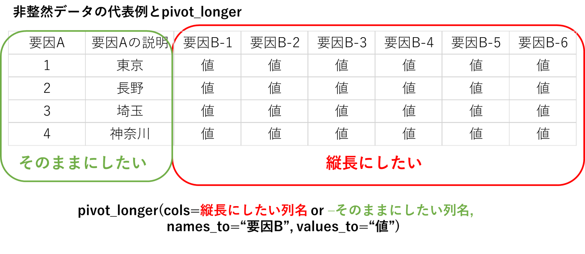

```{r, echo=FALSE}
library(knitr)
library(rmarkdown)
library(tidyverse)
#render("text.Rmd")

## Global options
options(max.print="75")
opts_chunk$set(echo=TRUE,
#                     cache=TRUE,
               prompt=FALSE,
               tidy=FALSE,
               comment=NA,
               message=FALSE,
               warning=FALSE)
opts_knit$set(width=75)
par(mar=c(4,4,3,1))
```
# 1週目

## １回目：趣旨
tidyverseって知ってますか？Rから呼び出せる一連の「便利パッケージ」を集めたメタパッケージのことです。非常に便利なので、VPA計算や将来予測ツールを提供しているfrasyrも、今後、tidyverseをどんどん取り入れていく方針に転換しています。普通にRを使って自分のデータ解析をしている人だけでなく、frasyrパッケージを使って資源計算されている人も、ぜひtidyverseの世界を知ってほしいと思っています。

それによって

- 整理されたデータ（整然データ、今後解説）を使った一連のデータ処理プロセスの固定化・単純化→研究の効率アップ
- tidyverseの標準グラフィックスシステムであるggplot2を使った効率的なグラフ作成→研究の効率アップ
- frasyr, frasyr_toolのバグ発見や修正依頼、さらには拡張コードを書くことへの障壁が少なく→皆でfrasyrを共同開発

のような効果が期待できます。

ここではできるだけ1回で１トピック、tidyverseで使うパッケージや関数の使い方、従来のR（裸のRと呼ぶことも）との違いなんかを、書きき込んでいきます。その後、何か思うところあったら、または追加の情報などをコメントとして返信してもらうことで、勉強を進めていければと思います。

今後想定するトピックとしては
- tidy data（整然データ）とは何か？
- パイプ %>%の使い方
- ggplot2
- データ成型用パッケージ dplyr を使ったデータの整理
- などなど
です。私も細かいことあまり知らないので、より分かっている人にさらに解説してもらったりできればうれしいです。

初回は参考URLを示すことで終わりにします。来週からぽつぽつアップしますので、よろしくお願いします。

- 本家のサイト　https://r4ds.had.co.nz/　英語だけど本一冊分が無料で読めます。これを１冊通して読めばtidyverseマスター！
- 上のサイトの日本語訳　https://www.amazon.co.jp/R%E3%81%A7%E3%81%AF%E3%81%98%E3%82%81%E3%82%8B%E3%83%87%E3%83%BC%E3%82%BF%E3%82%B5%E3%82%A4%E3%82%A8%E3%83%B3%E3%82%B9-Hadley-Wickham/dp/487311814X
- tidyverseの概説とさらなる参考情報　https://heavywatal.github.io/rstats/programming.html

## 2回目：インストールと使い方

tidyverseの世界に入るときに一番最初にやること、、それは、tidyverseパッケージのインストールです。パッケージのインストール方法はいろいろありますが、コピペで済むのでここでは以下のコマンドでインストールすることにします。コマンドを打つと、「どこのサーバーからパッケージをダウンロードするか？」を聞かれることがあるので、そこはJapan(Tokyo)を選んで（多分どこを選んでもよい）、インストールします。複数のパッケージを同時にインストールするので時間がかかります。

```{r, echo=TRUE, eval=FALSE}
install.packages("tidyverse")
```

無事インストールが終わったら、以下のコマンドを打ってパッケージを呼び出してみましょう。
```{r, echo=TRUE}
library(tidyverse)
```
すると、あまり見慣れない \-\- Attaching packages \-\- とかいう表記が出てきます。

\-\- Attaching packagesの下は、tidyverseをlibraryしたことで呼び出されるパッケージの一覧（tidyverseは複数のパッケージを寄せ集めたメタパッケージなので）とそれぞれのパッケージのバージョン番号を示しています。

\-\- Conflictの下には、tidyverseパッケージを呼び出すことで生じた関数名のコンフリクト（異なるパッケージ間で同じ関数名が使われている）の一覧が示されています。 x dplyr::filter() masks stats::filter() は、「パッケージdplyrとstatの両方でfilterという関数が定義されているけど、ここでは単にfilterを呼ぶ場合はdplyrのfilterを使いますよ」という意味です。

また、ここで出てくる「::」は、用いる関数名がなんのパッケージ由来のものかを明示的に示すための記号です（つまり　**パッケージ名::関数名** ）。この方法で関数を指定すれば、library(パッケージ名)という形であらかじめパッケージを呼び出しておかなくても、自分の環境内にインストールされたパッケージの中の関数を利用することができます。逆に、**パッケージ名::** なんてつけるのめんどくさいという人は、あらかじめ自分が使う関数をlibraryで呼び出しておけばいいわけです。ただし、上記のように、複数のパッケージ間で同じ関数名を使う場合はコンフリクトがおこるので（どういう状況でどちらのパッケージが優先されるかは？なんですが）、関数が意図下通りに動かずにエラーやバグが生じる恐れがあります。特に、dplyrのfilterは非常によく使い関数なんですが、statsパッケージのfilterと同名の関数になっているため、ライブラリの呼び出しの順番によってfilterがstatsのfilterになったりdplyrのfilterになったりします。ので、filterだけにはdplyr::filterとして使ったほうが良いかと思います。

```{r, echo=TRUE}
## ::の例 (まだtidyverseをlibraryしていない状況下でお試しください）

# パッケージtibble内にある関数tibbleを使う
# ::をつければlibraryする必要はない
data_test <- tibble::tibble(a=1:5, b=2:6)

# パッケージ内の関数を呼び出してから使う場合
# libraryしてあるので::は必要ない
library(tibble)  # or library(tidyverse)
data_test <- tibble(ax=1:5, bx=2:6)
```

（**注** frasyrやfrasyr_toolでは、tidyverse内の関数をすべて「パッケージ名::関数名」としてはいません（かわりに、Rコードの最初でlibrary(tidyverse)をする必要があります）。ただし、dplyr::filterなど、コンフリクトが起こりそうな関数については::をつけています。また、gridExtraやforeachなど、使用頻度の高くないパッケージについては::をつけて呼び出しています。）

最後、ちょっとマニアックな話になりましたが、たまに目にする::の意味を知らないと、Rのコードを読んでいて::に遭遇したときの不安感が非常に大きいと思いますので、少し説明してみました。

次回は、tidyverseの中のパッケージがそれぞれ何をしているかの概要をお話しします。

## 3日目：tidyverseの中身と代表的な便利関数

いよいよtidyverseをインストールしました。3回目は、tidyverseで呼び出される複数のパッケージの中で、従来関数と互換性のある、でも、tidyverseのほうがちょっと便利な関数を紹介します。既存のR関数との比較はRをすでにけっこう知っている人向けの解説なので、R初修者はわからなくても気にしなくてもいいです。

### パッケージ：tibble

データを格納する形式である **tibble (←→ data.frame)** を提供。

**Q1**: tibbleとdata.frameの違いを比較してみよう！

```{r, echo=TRUE}
dat_f <- data.frame(a=1:100, b=rnorm(100))  # 100行2列のデータフレームを作る
dat_t <- tibble::tibble(a=1:100, b=rnorm(100))  # 上と同じ操作
dat_f
dat_t
```

**A1**: 中身はほとんど同じだけど、中身を表示させたときの挙動が違うよ。通常のdata.frameは、全データを単純に全部出力しようとします。一方、tibbleの場合は行数や列数が長すぎるばあいは途中で省略し（# ... with 90 more rows（それとあと90行）, という表記）、また、冒頭にデータフレームの構造（# A tibble: 100x2 (100列２行のtibble形式の行列、それぞれの列の「型」がなんであるか（<int>(整数) <dbl>(連続数)など）の情報を出力します。

あと、リストを作成する **lst (←→ list)** も便利だということを最近知りました。

**Q2**: lstとlistの違いを比較してみよう！

```{r, echo=TRUE}
a <- 1:10
b <- c("char1","char2","char3")
list_list <- list(a,b)
list_lst  <- tibble::lst(a,b)
list_list
list_lst
```

**A2**: オブジェクトをまとめてリストにしたとき、lstは自動的にもともとのオブジェクトの名前がつくよ。関数の返り値をリスト形式にして返すとき、地味に便利です。

### パッケージ：readr
Rのパッケージの名前って、「機能」を示す単語＋r（R）というふうにつけるのが今風らしいです。なので、readrも、read + rと考えると、何かを「読む」ためのパッケージだということがわかります。同様に、stringrはstring + rなので、文字列を処理するための関数とわかります。（frasyrもそれにならって、FRA \+ SY (sustainable yield) \+ rということでつけてみました。）

readrはデータの入出力のための **read_csv( ←→ read.csv)**,  **write_csv (←→ write.csv)** などを提供しています。

**Q3**: read_csvとread.csvの違いを比較してみよう！

```{r, echo=TRUE}
write_csv(tibble(a=1:10, b=rnorm(10)), path="test.csv") # 読み込むためのデータを出力しておく
dat_read1 <- read.csv("test.csv")
dat_read2 <- readr::read_csv("test.csv")
```

**A3**: read_csvを使ってデータの読み込みに成功すると、読み込んだデータの概要を表示してくれます。また、読み込まれたデータは自動的にtibble形式になります。

## その他パッケージ

その他パッケージは追い追い紹介していきますが、いちおう以下に一覧表を作ってみました。

### 表：tidyverseが提供するパッケージと代表的な機能

|パッケージ名  |説明  |代表的な関数(括弧内は、tidyverseを使わない場合のRの関数) |
|---|---|---|
|tibble |より柔軟な形式のデータフレーム`tibble`等を提供 | データフレームを作成:`tibble` (`data.frame`), データをtibble形式に変換:`as_tibble`, リストを作成: `lst`(list) |
|tidyr |データを横長データから縦長データへ、縦長データから横長データへ変換する|横長データを縦長データに変換する: `gather` (`as.data.frame.table`), 縦長データを横長データに変換する: `spread` (`tapply`)|
|dplyr |データを整形したり、変換したりする | 列を抽出: `select`, 行を抽出: `filter`(`subset`), 列を追加または変更: `mutate`, データの並び替え: `arrange` (`sort`,`order`), パイプ演算子: `%>%`(詳細はBOX) |
|readr |データの読み込みと出力。読んだデータはtibble形式となる。 |`read_table`(`read.table`), `read_csv`(`read.csv`), `write_table`(`write.table`), `write_csv`(`write.csv`) |
|stringr |文字列操作| `str_`で始まる関数群。文字列結合: `str_c`(`paste`)|
|forcats |カテゴリカル変数を取扱う | `fct_`で始まる関数群。他の変数を使ってカテゴリカル要素の順番(level)を付け替える: `fct_reorder`, 登場頻度が多い（少ない）順にlevelを付け替える: `fct_infreq`|
|purrr |ループ処理やapply系関数 |`map_`で始まる関数群。各要素に関数を適用: `map`(`lapply`), mapしたのちにdata.frameとして結合: `map_dfr` (`sapply`) |	 
|ggplot2 |グラフ作成（詳細は後日) |`ggplot`, `geom_`で始まる関数群 |

次回は、上の表にある「縦長データ」「横長データ」について解説します。

### どうでもいい？雑談： \. と \_ の違いについて

裸のRの関数名は単語と単語の間を\.で区切るものが多いです。一方、今風のRの関数は\_で区切るものが主流です。\.の関数名はちょっと古い関数（または、メソッドという特別な機能が付与された関数）で、\_の関数名は新しめの関数と覚えておくと便利です（frasyrでもそうです）。

なぜ、\.から\_へのシフトがおこったんでしょう？

20年前からRを使っていた人は、オブジェクトや関数の名前に絶対\_を入れませんでした。というのは、昔、Rでは \_ が「代入記号」として利用されていたんです。なんで、うっかり `dat_1` なんて書いてしまうと、`dat <- 1` または`dat = 1`と同じ動きをして、プログラムがめちゃくちゃになったのです、、。

しかし、 この仕様はかなり昔に変更され、あと、プログラミングの [命名規約](https://ja.wikipedia.org/wiki/%E5%91%BD%E5%90%8D%E8%A6%8F%E5%89%87_(%E3%83%97%E3%83%AD%E3%82%B0%E3%83%A9%E3%83%9F%E3%83%B3%E3%82%B0) ) では\_を使うほうが良いということもあり、私もようやく最近オブジェクト名に \_を使えるようになりました。

ということで、frasyrでも、関数名やオブジェクト名に\.と\_が混在していますが、\.で区切られた名前の関数はたいてい古く、\_で区切られた名前の関数や関数の引数は比較的最近作られた関数だと区別してください（上に紹介したread.csvとread_csvの違いのように）。たとえば、frasyrにはplot.futuresとplot_futuresという関数がありますが、前者は裸のRで書かれた古い（素朴な）関数で、後者はggplot2で書かれた新しい関数です。

（\.で区切られた関数名は「メソッド」という新しい別の機能が付与されるため、けっこう使いづらく、最近ではむしろ避けられています。）


## ４日目：tidy data (整然データ) とは？

４日目はとうとうtidyverseの根幹である「整然データ(Wickham 2014)
」について解説します。tidyverseは、「ちょと便利な」機能を提供するためだけのものではなく、「整然データ」と呼ばれる形式のデータを解析するためのものなんです。では「整然データ」ってなんでしょうか？

## 非整然データと整然データ

たとえば、A地点とB地点で、とある種のサンプリングをおこない、その個体群が減っているか、増えているかを調べる調査を実施したとします。
サンプリングでは網を一定時間ひいて、そこで採取された魚の数をカウントしました。そして、毎年の調査から以下のような結果が得られたとします。

### 表1. 非整然データ（横長データ）の例
```{r, echo=FALSE, fig.caption="表：地点A、Bにおける調査努力量（曵網時間）あたりの個体数"}
data1 <- rbind(c(1000,720,420,100),
               c(120,50,20,10))
dimnames(data1) <- list(c("地点A","地点B"),2010:2013)
kable(data1, format = "markdown")
```

2010年から2013年までの毎年のサンプリングの結果、地点Aでは1000個体から100個体に、地点Bでは120個体から10個体に個体数が減少してます。どうやら、A地点でもB地点でも個体数は約10分の1に減っているようです。

このような形式の表は地点A, B間で、年ごとの個体数の違いを比較するのには適していますが、調査データそのものをこのような形式で記録していこうとすると、データの記録や解析する際にはいろいろと不都合が生じます。例えば、

1. それぞれの年・地点での調査は1回だけでなく複数回実施した
2. 採取された魚の数に影響する潜在的な要因（調査時の季節や天気など）も同時に記録し、それらの要因がCPUEに影響するかを見たい

ような場合です。見せるための表でなく、記録したり解析したりするためには、どのようにデータを記録していけばよいでしょう？

整然データ (tidy data､Wickham 2014) は、このような問題を解決するために提唱されているデータの形式のことです。Wickham (2014)は整然データの構造を

1. 個々の変数が1つの列をなす
2. 個々の観測が1つの行をなす
3. 個々の観測の構成単位の類型が1つの表をなす
4. 個々の値が1つのセルをなす

のように定義しています。特に重要な点は、整然データではひとつの列に個々の変数が、行に個々の観測が記録されるということです。
それに従って表1を整然データに直してみましょう。それは表2みたいになります。

### 表2. 整然データ（縦長データ）の例
```{r, echo=FALSE, fig.caption="表：地点A、Bにおける調査努力量（曵網時間）あたりの個体数"}
data2 <- tibble(
    area=rep(c("地点A","地点B"),each=4),
    year=rep(2010:2013,2),
  cpue=c(1000,720,420,100,120,50,20,10))
kable(data2, format = "markdown")
```

このような形式でデータを記録していれば、ある年・ある地点で観測を追加で行った場合でも行（＝観測）を追加するだけで簡単にデータを追加できます。また、それぞれの観測において不随する情報（＝変数）を追加で記録したい場合、列を増やせば簡単に記録できます。整然データであれば、行・列を増やすことでいくらでもデータも変数も追加できるのです。

整然データはデータ数が増えるほど表が縦に長くなるため、縦長データ（long-format）と呼ばれることもあります。それに対して、列と行がそれぞれ変数で構成された表１のようなデータは横長データ（wide-format）と呼ばれます。縦長データは、データ数が非常に多い場合にはメモリを消費してしまう欠点もあります。たとえば1千地点×100年の10万件のデータの場合、横長データではデータの保存におおよそ10万バイト（100KB）しか必要としないですが、横長データでは10万件のデータにそれぞれ地点のラベルと年のラベルをつけるため30万バイト(300KB)必要になります。

## まとめ

**tidy data = 整然データ = 縦長データ**

**non-tidy data = 非整然データ =? 横長データ**

自分の手元にあるデータが整然データになっているか非整然データになっているか、確認してみましょう。もし自分のデータが非整然データである場合に、非整然データを整然データに変換する作業がデータ解析の第一歩になります。次回は、表１で示したような形式の横長データを縦長データに成型するための方法などを紹介します。Teamsで話題になった`dplyr::pivot_longer`を使っていくことになります。（古い関数としては`dplyr::gather`に対応します）。

## frasyrにおけるtidy dataの取り扱い

frasyrでは、VPAへのインプットデータ、また、関数を適用したあとの出力データはtidy形式ではありません。ただ、出力データをtidy形式に変換するための関数は実装しています（以下、参照。名前の統一感がないのが課題ですが、、）。ggplotを使った描画関数は、これらのtidy形式に変換したデータを使って描画するようにする方式に変えようとしているので、将来的には、独自の関数を使った出力結果でも、同じtidy形式で揃えれば、frasyrの描画関数が適用できるようにしたいと思っています。

#### frasyrで実装しているtidy形式への変換関数
- `frasyr::convert_vpa_tibble`: VPAの推定結果をtidy形式に変換する
- `frasyr::convert_future_table`: 将来予測の結果をtidy形式に変換する
- `frasyr::convert_SR_tibble`: 再生産関係の推定結果をtidy形式に変換する


## 5日目：（ちょっと寄り道）%>% について

前回の最後に、次はデータの縦横変換について解説すると書きましたが、それに入る前に、tidyverseでコードを書いているとよく出現する謎の記号 `%>%`（dplyrパッケージに含まれます） について解説します。 Rで使われる記号 `+` とか`%`とかはよく目にすると思います。`%>%`もその仲間で、プログラミング言語上で一般に「パイプ」と呼ばれる働きをします。「パイプ」は下図のように、関数Aの出力値を関数Bの入力値に繋げるような動作です。


`%>%`はtidyverseを使うから使わないといけないというわけではありませんが、tidyverseが提供する関数と相性が良い（たぶんそのようになるように設計されているんだと思います）ので、tidyverseを使ったコードで`%>%`は頻出します。frasyr_toolでも`%>%`はよく出てきます。わかってしまえばそんなに難しいものではないので、ここで`%>%`の使い方に慣れ、そのメリットについて学びましょう。

### 実例

さきも書いたように`%>%`は関数の「出力」をそのまま別の関数の「入力」につなげる役割をします。

単純な例としては、1:10までの数を足して、その平方根をとって、結果を表示するという作業をやってみます。愚直に書くと、

```{r, echo=TRUE}
x <- 1:10
x <- mean(x)
x <- sqrt(x)
print(x)
```

となりますね。また、Rでは代入をいちいち省略して一行で

```{r, echo=TRUE}
x <- print(sqrt(mean(1:10)))
```

のように書くこともできます。

しかし、１行で一気に書いてしまうと、１～10を平均して平方根をとって表示するというプロセスが逆の入れ子状になっていて（「表示する（平方根をとる(平均する（1から10の数）））」、もっと複雑な処理になったとき、プログラムの可読性（読みやすさ）が非常に悪くなります。一方で、一番最初の例のように4行で書く場合、同じ変数`x`に何度も異なる数を代入しているため、**最終的にxがどのような数になるのか、最後の行を読むまでわかりません**。

以下のように、それぞれの値に中身がわかるように名前を付ける方法もあります。大規模なプログラムで、途中経過が大事な場合にはこのような方法が勧められますが、一時的においておくだけの変数にもすべて名前をつけるのは膨大な作業で、また、名前がコンフリクトして(間違って別の変数に同じ名前をつけて）しまう可能性があります。

```{r, echo=TRUE}
x_value <- 1:10
x_mean <- mean(x)
x_sqrt <- sqrt(x)
print(x)
```

そこで、パイプ`%>%`の登場です。上の例はパイプを使って

```{r, echo=TRUE}
library(tidyverse)
x <- 1:10 %>%
      mean() %>% # 上の行(1:10)が関数meanの一番目の引数になる
      sqrt() %>% # 上の行の関数meanの結果がsqrtの一番目の引数になる
      print() # 同様
```

のように書くことができます。1～10の数を、平均して、平方根をとり、値を表示する、そしてをれをｘに代入するという一連の作業が（パイプに慣れれば）一目でわかります。

### パイプクイズ：以下のRコードをパイプを使って書き直しましょう  

Q1:
```{r, echo=TRUE}
hist(apply(matrix(rnorm(10000),100,100),2,mean))
```

A1:
```{r, echo=TRUE}
rnorm(10000) %>%
   matrix(100,100) %>%
   apply(2,mean) %>%
   hist()
```

Q2:
```{r, echo=TRUE}
dat_example <- tibble::tibble(a=1:10, b=rnorm(10))
plot(dat_example,type="b")
```

A3:
```{r, echo=TRUE}
tibble::tibble(a=1:10, b=rnorm(10)) %>%
    plot(type="b")
```

ほとにわかりやすいか？と疑問にもたれるかたもいらっしゃると思いますが、tidyverseの関数を使うとほんとにわかりやすくなるんです、、、。次回以降、tidyverseの主要な機能を解説していくので、そのときにパイプも一緒に使っていきます。

さらに、`.`(一番最初の引数以外のところにパイプする)とか、`%T>%`(途中でグラフを出力する)とか、`%$%`（データフレームの変数をそのまま使う）とか、途中で`->`を挟むとか、いろいろあるようです（わたしもまだそのあたり使いこなせていません）。たとえば　https://www.medi-08-data-06.work/entry/paipe_r　とか参照ください。

## 6日目：データの横→縦変換

では、６日目、とうとうデータを縦横に変換していきます。といってもそんなに難しいことはなく、`tidyr`パッケージにある`pivot_longer` (横長データを縦長データへ)と、`pivot_wider`（縦長データを横長データへ）を使います。以前は、`spread`、`gather`という名前の関数が使われていましたが、いまいち名前がわかりにくいということで、`pivot_longer`、`pivot_wider`に変わったようです。たしかに、以前の関数名のときは、どっちがどっちかわからなくて毎回ググるはめになっていたんですが、新しい関数名だとググらなくても名前から機能が想像できますね。

４日目に解説したように、縦長のデータは整然データ、横長のデータは非整然データに対応しますが、「整然データ」というと、最初に整然データの概念を提唱したWickham (2014)の定義にちゃんと従っているデータ、というような印象を受けるような気がするので、（特別に「整然データ」であることを強調したいとき以外は）ここでは縦長・横長データと言います。

## 横長データを縦長データへ：`pivot_longer`

データをとった（もらった）がめっちゃ雑然としている、、。解析するためにはまずこれを「整然」データに直さないといけない、、というのがだいたいデータを解析するときの、一番最初にする作業だと思います。

「幸福な家族はどれも似ているが、不幸な家族は不幸のあり方がそれぞれ異なっている。」とはトルストイの名言ですが、整然（縦長）データを定義したWickham (2014) は、「家族と同じく、整然データセットはどれも似ているが、雑然データセットは雑然のあり方がそれぞれ異なっている」と述べています。つまり、雑然としているデータの雑然度合いは、それぞればらばらなので、非整然データを整然データに成型するやり方を統一的に提供するのはなかなか難しいです。

なので、ここでは、表１（４日目）で示した一般的な横長データを、表２のような縦長データに変換するときのコマンドを軽く紹介します。個々の事例（こんなデータの場合はどうする？）については、別途、例を出しあって解決方法を探ることにしましょう。

```{r, echo=TRUE}
# 表1の横長データ
data1 <- rbind(c(1000,720,420,100),
               c(120,50,20,10))
dimnames(data1) <- list(c("地点A","地点B"),2010:2013)

# pivot_longerを使って縦長データへ変換する
data1_long <- data1 %>% as.data.frame() %>%
     tibble::rownames_to_column(var = "area") %>%
     tidyr::pivot_longer(col=-area, names_to="year", values_to="CPUE")

# (補足) 裸のRでやる場合
data1_long2 <- as.data.frame.table(data1)
colnames(data1_long2) <- c("area","year","value")

```

上のコードの1行目では、`data1`をデータフレーム（data.frame）形式に変換しています。これは、２行目で実行するtibble::rownames_to_column 関数がdata.frame（またはtibble形式）でないと受け付けてくれないからです。（ここで`tibble::as_tibble`でtibble形式にする方法もありますが、その場合には行の名前が失われてしまって２行目で困るので、ここではdata.frameにしています。）

２行目では、data1に行名（rownames）として記録されていた地点A、地点Bといった情報を「列(col)」データに出力しています。そのためのコマンドが`tibble::rownames_to_column`です（私もこれを書いているときに知りました）。引数`var`では、新しい列の名前、ここでは"area"としました、を指定します。これを指定しなくても関数は動きます。その場合とデフォルト値のの`rownames`という名前がつきます。

そして３行目でいよいよ`tidyr::pivot_longer`でデータを縦長に変換します。引数colでは **縦に並べたい列の名前** を指定します。 ここでは「area以外全部の列」を縦に並べたいので、`-area`というふうに指定します。あと、`names_to`は縦に並べたときに新しくできる要素の列の名前（指定しないとデフォルト値の"name"となります）、`values_to`は新しくできる値の列の名前（指定しないとデフォルトの"value"となります）。

わかりやすいかどうかはわかりませんが、以下、pivot_longerの構造を図示してみました。



さっき、非整然データはいろいろだ、と言いましたが、けっこうありそうな非整然データは、２つの要因があってそれを２次元の表にまとめてしまう、というものだと思います。この場合要因Aは行に記録されているけど、要因Bの各要素は列に展開されています。そのような場合、要因Bが書いてある列（赤く囲んだところ）のほうを「縦長へ」指定する＝この列名をpivot_longerの引数colsに指定する、ということになります。図の例で、縦長に変換したい列は要因B-1, 要因B-2, ... になります。ただ、これが多すぎて書くのが大変だという場合、`-`(マイナス)記号を使って `col=c(-要因A, -要因Aの説明)`とすると「要因Aと要因Aの説明以外」が縦型に変換されます。または、`help(povot_longer)`の`example`でもいろいろ紹介されていますが、列名の指定の時に`starts_with("要因B-")`と書くと、「要因B-」で始まる列名すべてを取り出してきてくれます。

### 練習問題:

frasyrのvpa関数へのインプットデータも典型的な横長データです。これを縦型データに直して、また、年齢別漁獲尾数、自然死亡係数、、などの複数のデータを一つのデータセットに変換してみましょう。

例データはこちらになります。

```{r, echo=TRUE}
# githubのfrasyrの例データを読み込む
caa   <- read.csv("https://raw.githubusercontent.com/ichimomo/frasyr/dev/data-raw/ex2_caa.csv",  row.names=1)
waa   <- read.csv("https://raw.githubusercontent.com/ichimomo/frasyr/dev/data-raw/ex2_waa.csv",  row.names=1)
maa   <- read.csv("https://raw.githubusercontent.com/ichimomo/frasyr/dev/data-raw/ex2_maa.csv",  row.names=1)
```

### A1:素朴なやり方

上の例を少し変えて、以下のようにやります。

```{r, echo=TRUE}
# caaはすでにdata.frameになっているのでas.data.frameの行は必要ない
# yearのラベルの前にXというのがついているので、縦型変換するときにそれを無視する引数 names_prefix="X" をつける
data_caa <- caa %>% tibble::rownames_to_column(var = "age") %>%
      tidyr::pivot_longer(col=-age, names_to="year", values_to="value",names_prefix="X")

# 同じことをwaa, maaについても繰り返す
data_maa <- maa %>% tibble::rownames_to_column(var = "age") %>%
      tidyr::pivot_longer(col=-age, names_to="year", values_to="value", names_prefix="X")
data_waa <- waa %>% tibble::rownames_to_column(var = "age") %>%
      tidyr::pivot_longer(col=-age, names_to="year", values_to="value", names_prefix="X")      

# bind_rowsという関数で縦にくっつける
data_vpa <- dplyr::bind_rows(data_caa, data_maa, data_waa, .id="id")      
```

### A2:ここまでやっちゃう？というやり方（一行で！）

最近学んだこと、今後紹介する関数を取り入れてやるとこんな感じに、、、。

```{r, echo=TRUE}
data_vpa <- tibble::lst(caa, waa, maa) %>%
     purrr::map_dfr(. %>% tibble::rownames_to_column(var = "age") %>%
                     tidyr::pivot_longer(col=-age, names_to="year", values_to="value", names_prefix="X"),
                    .id="data_type")
print(data_vpa)                    
```

上のコードの意味は以下の通りです。

- caa, waa, maaに対して同じような処理を繰り返すのが無駄なので、caa, maa, waaはリストに入れて一括して処理するようにする。そのさい`tibble::lst`を使うと、オブジェクト名がそのままリストの名前になるのでわざわざ`list(caa=caa, maa=maa, waa=waa)`としなくてよくて便利。
- 上で作ったリストに対して、一括して同じ関数を適用して結果をtibble形式でくっつけるための関数 `purrr::map_dfr`を適用
- リストの中身に適用する関数は `. %>% ` を使って省略。関数内のコードは上のA1で示したコードと同じ
- `purrr::map_dfr`の引数`.id`に列名を与えると、結合する３つのデータフレームの名前を列として出力してくれる（→与えたリストに名前がついている場合、その名前をidにしてくれる）

ここまでくると、tidyverseが本当にわかりやすいのかわからなくなりますね:star:

## まとめ
今回はデータを横長データから縦長データに変換する`pivot_longer`をご紹介しました。生データをゲットしたさいに**一番最初にやる作業になる**と思います。一方、縦長データを横長データにするのは`pivot_wider`になりますが、それは、逆に **解析が全部終わって** データのサマリーをわかりやすい表に出力するときに使います。pivot_widerはちょっと力尽きてあんまり紹介できませんでしたが、pivot_longer()と逆のことをすると思っていただければ、、。

次回は、整然データを操作するいろんな関数をご紹介します。

## 7日目：整然データを用いた解析の手順

いったんデータを整然形式にしてしまえばあとはこっちのものです。tidyverseで用意されているさまざまな関数を使ってデータの加工、サマリーの作成、解析などを行っていきましょう。

6日目まででこれだけ苦労してデータを整然データに変換したのはなぜか？それは、この日（７日目）のためです。データをいったん同じような形式＝整然データに揃えてしまうことで、「整然データに至るまでのプロセスは様々」だけど「整然データに至ってからの解析は同じ」になります（下図）。一方で、「非整然データ」を使って直接解析まで持ち込もうとすると「解析の手順はデータによって様々」となり、データや研究テーマが違うごとに異なるコードを書く必要が出てきます。さらに、データをもともと整然データで整理しておけば、データを整然データに直す手順も省略することができます。


では、整然データをとったあとの「おきまりの解析の手順」ってどんなものでしょうか？そんな多くはありません。考えつくのは、下のような感じでしょうか。

1. データの全体像を把握する: `dplyr::summarize`
    - 得られている変数の範囲や観測値の頻度、値の分布なんかを把握します
2. 解析に用いるデータを抜き出す、並び替える：`dplyr::filter`、`dplyr::arrange`
    - 1で確認した値の分布から、外れ値・異常値と思われるデータを解析から除外します
    - 時空間データなんかを扱う場合には、解析の対象とする範囲のみにデータを絞ったりすることもあります
3. データを変換したり、別のデータをくっつけたりする：`dplyr::mutate`, `dplyr::left_join`, `dplyr::right_join`
    - 応答変数を変数変換したり、説明変数をカテゴリ化したりするときに新たな列を追加します
    - 別のソースから得られたデータをくっつけて、説明変数として用いる（たとえばCPUEデータに、衛星から得られた水温情報をくっつけるなど）
4. データを可視化し、統計モデルのイメージをつかむ（`ggplot`）
5. 統計モデルを適用し、パラメータ推定する
6. 結果を要約し、見やすい表を作る：`tidyr::pivot_wider`

4のggplotを使った可視化については８日目にします。今回は、1-3のプロセスで必要になるパッケージ`dplyr`の代表的な関数と使用例を紹介します。（私の体感による）使用頻度順です。

### 特定の条件にマッチするデータを抜き出す：`dplyr::filter`（とにかくよく使う）

解析から外れ値を除いたり、解析の範囲を狭めたりする場合などに使います。ここでは、(1) tidyverseを使わず裸のRでやる場合から、(2) 普通にdplyr::filter関数を使う場合、(3) それに加えてパイプ`%>%`を使う場合、とちょっとづつ変えています。

```{r, echo=TRUE, label="filter"}
# (1) 裸のRを用いる場合
data1_areaA <- data1_long[data1_long$area=="A", ]

# (2) data1_longからA地点のデータのみを抜き出す場合
data1_areaA <- dplyr::filter(data1_long, area=="A")

# (3) data1_longからA地点のデータのみを抜き出す場合(%>%)を使って
data1_areaA <- data1_long %>%
                 dplyr::filter(area=="A")
```

一押しの書き方はtidyverseを使いつつパイプ`%>%`も使う(3)の書き方になりますが、(1)から(2)、(2)から(3)へは何がそんなに「良く」なっているんでしょうか？

**裸のR(1)からtidyverse(2)へ：** なんといっても説明が楽ですね。例えば、(1)のコードの意味を人に説明してくれと言われて、どう説明します？　説明するためには、関数でない記号`[]`, `$`の意味をまずわからいといけないです。そのうえで、データの列のところ（？かっこの左側）に条件式を入れて、それが`c(TRUE, FALSE, ... )`のベクトルになるので、条件式にマッチする行が取り出される、、、というような、、、。Rを使い慣れている人には当たり前のことでも、初修者にはかなり敷居が高いと思います。一方、dplyr::filterであれば、「特定の条件にマッチする行を取り出すには関数dplyr::filterを使います。使い方はdplyr::filter(データ, 条件式)です。」と説明でき、シンプルです。

**(2)から(3)へ** とくにdplyrで提供される基本関数において、一番目にとる引数（第一引数）は（tidyな）データフレームであることが想定されているような感じです。第二引数以降は条件の様々な設定になります。さらに、関数の返り値もtidy形式になっていることが多いので、**データ1→関数→データ2→関数→データ3**、と数珠繋ぎでコードを書いていくことになります。そのため、`%>%`を使って、**データ1→関数`%>%`関数`%>%`→データ3** とすれば、関数の間に中間的に生成されていたデータ２を省略することができます。

### 新しい列を付け足す：`dplyr::mutate` (これもよく使う)

`dplyr::filter`と（体感的に）同じくらいよく使う関数は`dplyr::mutate`（新しい列を足す）です。これも`dplyr::filter`と同じく、第一引数にデータをとって、第二引数以降に条件を入れます。さっきの`dplyr::filter`から続きで書くと以下のようになります。

```{r, echo=TRUE, label="mutate"}
# data1_longからA地点のデータのみを抜き出し、新しい変数（log_CPUE）を付け足す
# mutateを使う場合
data1_areaA <- data1_long %>%
                 dplyr::filter(area=="A") %>%
                 dplyr::mutate(log_CPUE = log(CPUE))
```

`dplyr::filter`でも`dplyr::mutate`でも、第二引数で登場する`area`、`CPUE`は、与えたデータの列名です。列名の場合にはダブルクォーテーションはつけません。

### 特定の列だけを取り出す：`dplyr::select` (たまに使う)

特定の列だけを選ぶ関数です。たとえば、上では新しい変数`log_CPUE`を作ったので、CPUEの列は不要です。そこで、以下の例のように`select(-CPUE)`として、取り除きたい列名を指定すると、その列が取り除かれます。マイナスをつけない場合は、指定された列だけが残ります。

```{r, echo=TRUE}     
data1_areaA <- data1_long %>%
                 dplyr::filter(area=="A") %>%
                 dplyr::mutate(log_CPUE = log(CPUE)) %>%
                 dplyr::select(-CPUE) # CPUEを取り除く
                # dplyr::select(area, year, log_CPUE) # マイナスで指定しない場合
```

### データの要約統計量などを示す：`dplyr::summarise` (たまに使う)

平均値や分散などの要約統計量を見てみたいときに使います。

```{r, echo=TRUE}
# data1_longのCPUEの平均値と分散を計算する
data1_long %>% dplyr::summarise(CPUE_mean=mean(CPUE), CPUE_var=var(CPUE))
```

第二引数は、「新しく作られる列名=ある列に対する処理（mean(CPUE)とか）」を書きます。複数の統計量を計算したい場合には、複数の命令を並べていけばいいです。ただ、上の例は非常に単純な例でそんなに実際的ではありません。`dplyr::summarise`は、実際には、グループ化のための関数`dplyr::group_by`でデータを「グループ化」してから使います。たとえば、平均値と分散を「地点(area)ごと」に計算したい場合は、

````{r, echo=TRUE}
# data1_longのCPUEの平均値と分散を地点ごとに計算する
data_summary <- data1_long %>%
                  group_by(area) %>% # grouping by area
                  dplyr::summarise(CPUE_mean=mean(CPUE), CPUE_var=var(CPUE)) %>%  # calculate statistics
                  print()
```

こんな感じです。これを裸のRを使ってやる場合には、関数`tapply`を使います。ただ、平均と分散の両方について２回書いてから並べないといけないので、ちょっと面倒くさいです。

```{r, echo=TRUE}     
# 裸のRの場合
data1_summary0 <- data.frame(CPUE_mean=tapply(data1_long$CPUE,data1_long$area,mean),
                             CPUE_var=tapply(data1_long$CPUE,data1_long$area,var))
```

ただ、`dplyr::summarise`も超絶便利というわけではなく、summaryするための関数（上の例でいうと`mean`とか`var`とか）の返り値は一つでないといけないという制約があります。なので、`quantile(probs=c(0.05,0.5,0.95))`とかは使えません（ただし、dplyr1.00からは使えるようになるらしいです。 https://www.tidyverse.org/blog/2020/03/dplyr-1-0-0-summarise/ 。残念ながらまだ私の環境下ではinstall_githubに失敗して試せていません）。

### 別のデータフレームをくっつける：`dplyr::left_join`,`dplyr::right_join`など`dplyr::XXX_join`という関数（使うのはたまにだけど、重要）

さいご、そんなに頻繁には使いませんが、これを知っているとすごく便利な`left_join`,`right_join`など`XXX_join`という関数を紹介します。これは、 **２つのデータをセットをマッチングしてくっつける** 働きをします。裸のRでは`merge`という関数に相当します。

たとえば、地点Aと地点Bの緯度・経度のデータが以下のように`data_lonlat`というデータセットにあったとします。CPUEを記録した`data1_long`のデータセットの解析のさい、場所情報は地点は名前でなく、その地点の緯度・経度の情報として使っていきたい場合があります。そのさい、２つのデータを以下のようにくっつけます。

```{r, echo=TRUE}     
# 地点の緯度経度を示す別のデータセット
data_lonlat <- tibble(area=c("地点A","地点B"),
                      longitude=c(150,170),
                      latitude=c(45,51))

# left_joinでくっつける                      
data1_long <- data1_long %>%
                left_join(data_lonlat) %>%
                print()
```

そうすると、CPUEデータの地点A、地点Bに対応した緯度経度が新しい列として加わりました。left, rightの違いは、left_joinの場合には左側のデータに右のデータをくっつける、right_joinはその逆です。あと、いろいろinnner_joinとかありますが、そのあたりは適当にググってください。

また、完全に別のデータセットでなくても良くて、さきに作った地点Aと地点Bごとの平均値・分散を計算したデータ`data_summary`を元のデータ`data1_long`にくっつけるような使い方もあります。それにより、もともとのデータに「地点ごとのCPUEの平均値・分散」データが加わり、CPUEを地点ごとの平均値で割ってそれぞれの地域ごとのCPUEのレベルをそろえたいような場合に使えます。

```{r, echo=TRUE}     
data1_long <- data1_long %>%
                left_join(data_summary) %>% # 平均値データをくっつける
                mutate(CPUE_standardized=CPUE/CPUE_mean) %>% # CPUEを基準化した新しい列を加える
                print()
```

### まとめ

今回はデータを解析する前に整理する関数を紹介しました。普段は、どの関数がどのパッケージに属しているかなんて気にせずに使っているんですが（`library(tidyverse)`とすれば`dplyr::`とかつける必要はないので）、今回それを明示的に書くためにいろいろ調べたら、データ整理のための関数は`dplyr`にほとんどまとめられているということに気づきました（遅い）。一方、データを縦横変換する関数は`tidyr`ですね。

なのでデータ解析の手順とパッケージは

- tidyrでデータを横縦変換してtidy dataに
- dplyrでデータ整理
- ggplotでデータの可視化
- いろんな統計ツールで解析
- tidyrでデータを縦横返還して結果をまとめる

こんな感じで対応していて、tidyrで始まってtidyrで終わるんだなと関心しました。

ということで、次は、tidyverseで使われる可視化パッケージggplotについてご紹介します。

## 8日目：ggplot2とtidyverse

## 9日目： 例データの解析 (1)
