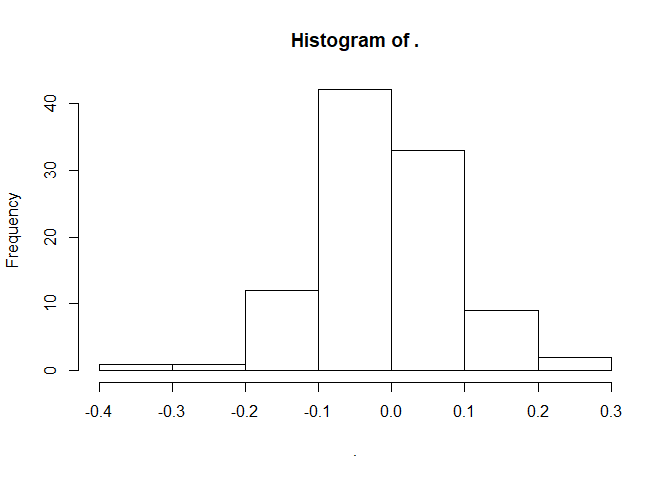

1週目
=====

１回目：趣旨
------------

tidyverseって知ってますか？Rから呼び出せる一連の「便利パッケージ」を集めたメタパッケージのことです。非常に便利なので、VPA計算や将来予測ツールを提供しているfrasyrも、今後、tidyverseをどんどん取り入れていく方針に転換しています。普通にRを使って自分のデータ解析をしている人だけでなく、frasyrパッケージを使って資源計算されている人も、ぜひtidyverseの世界を知ってほしいと思っています。

それによって

-   整理されたデータ（整然データ、今後解説）を使った一連のデータ処理プロセスの固定化・単純化→研究の効率アップ
-   tidyverseの標準グラフィックスシステムであるggplot2を使った効率的なグラフ作成→研究の効率アップ
-   frasyr,
    frasyr\_toolのバグ発見や修正依頼、さらには拡張コードを書くことへの障壁が少なく→皆でfrasyrを共同開発

のような効果が期待できます。

ここではできるだけ1回で１トピック、tidyverseで使うパッケージや関数の使い方、従来のR（裸のRと呼ぶことも）との違いなんかを、書きき込んでいきます。その後、何か思うところあったら、または追加の情報などをコメントとして返信してもらうことで、勉強を進めていければと思います。

今後想定するトピックとしては - tidy data（整然データ）とは何か？ -
パイプ %&gt;%の使い方 - ggplot2 - データ成型用パッケージ dplyr
を使ったデータの整理 - などなど
です。私も細かいことあまり知らないので、より分かっている人にさらに解説してもらったりできればうれしいです。

初回は参考URLを示すことで終わりにします。来週からぽつぽつアップしますので、よろしくお願いします。

-   本家のサイト　<a href="https://r4ds.had.co.nz/" class="uri">https://r4ds.had.co.nz/</a>　英語だけど本一冊分が無料で読めます。これを１冊通して読めばtidyverseマスター！
-   上のサイトの日本語訳　<a href="https://www.amazon.co.jp/R%E3%81%A7%E3%81%AF%E3%81%98%E3%82%81%E3%82%8B%E3%83%87%E3%83%BC%E3%82%BF%E3%82%B5%E3%82%A4%E3%82%A8%E3%83%B3%E3%82%B9-Hadley-Wickham/dp/487311814X" class="uri">https://www.amazon.co.jp/R%E3%81%A7%E3%81%AF%E3%81%98%E3%82%81%E3%82%8B%E3%83%87%E3%83%BC%E3%82%BF%E3%82%B5%E3%82%A4%E3%82%A8%E3%83%B3%E3%82%B9-Hadley-Wickham/dp/487311814X</a>
-   tidyverseの概説とさらなる参考情報　<a href="https://heavywatal.github.io/rstats/programming.html" class="uri">https://heavywatal.github.io/rstats/programming.html</a>

2回目：インストールと使い方
---------------------------

tidyverseの世界に入るときに一番最初にやること、、それは、tidyverseパッケージのインストールです。パッケージのインストール方法はいろいろありますが、コピペで済むのでここでは以下のコマンドでインストールすることにします。コマンドを打つと、「どこのサーバーからパッケージをダウンロードするか？」を聞かれることがあるので、そこはJapan(Tokyo)を選んで（多分どこを選んでもよい）、インストールします。複数のパッケージを同時にインストールするので時間がかかります。

    install.packages("tidyverse")

無事インストールが終わったら、以下のコマンドを打ってパッケージを呼び出してみましょう。

    library(tidyverse)

すると、あまり見慣れない -- Attaching packages --
とかいう表記が出てきます。

-- Attaching
packagesの下は、tidyverseをlibraryしたことで呼び出されるパッケージの一覧（tidyverseは複数のパッケージを寄せ集めたメタパッケージなので）とそれぞれのパッケージのバージョン番号を示しています。

--
Conflictの下には、tidyverseパッケージを呼び出すことで生じた関数名のコンフリクト（異なるパッケージ間で同じ関数名が使われている）の一覧が示されています。
x dplyr::filter() masks stats::filter()
は、「パッケージdplyrとstatの両方でfilterという関数が定義されているけど、ここでは単にfilterを呼ぶ場合はdplyrのfilterを使いますよ」という意味です。

また、ここで出てくる「::」は、用いる関数名がなんのパッケージ由来のものかを明示的に示すための記号です（つまり　**パッケージ名::関数名**
）。この方法で関数を指定すれば、library(パッケージ名)という形であらかじめパッケージを呼び出しておかなくても、自分の環境内にインストールされたパッケージの中の関数を利用することができます。逆に、**パッケージ名::**
なんてつけるのめんどくさいという人は、あらかじめ自分が使う関数をlibraryで呼び出しておけばいいわけです。ただし、上記のように、複数のパッケージ間で同じ関数名を使う場合はコンフリクトがおこるので（どういう状況でどちらのパッケージが優先されるかは？なんですが）、関数が意図下通りに動かずにエラーやバグが生じる恐れがあります。特に、dplyrのfilterは非常によく使い関数なんですが、statsパッケージのfilterと同名の関数になっているため、ライブラリの呼び出しの順番によってfilterがstatsのfilterになったりdplyrのfilterになったりします。ので、filterだけにはdplyr::filterとして使ったほうが良いかと思います。

    ## ::の例 (まだtidyverseをlibraryしていない状況下でお試しください）

    # パッケージtibble内にある関数tibbleを使う ::をつければlibraryする必要はない
    data_test <- tibble::tibble(a = 1:5, b = 2:6)

    # パッケージ内の関数を呼び出してから使う場合 libraryしてあるので::は必要ない
    library(tibble)  # or library(tidyverse)
    data_test <- tibble(ax = 1:5, bx = 2:6)

（**注**
frasyrやfrasyr\_toolでは、tidyverse内の関数をすべて「パッケージ名::関数名」としてはいません（かわりに、Rコードの最初でlibrary(tidyverse)をする必要があります）。ただし、dplyr::filterなど、コンフリクトが起こりそうな関数については::をつけています。また、gridExtraやforeachなど、使用頻度の高くないパッケージについては::をつけて呼び出しています。）

最後、ちょっとマニアックな話になりましたが、たまに目にする::の意味を知らないと、Rのコードを読んでいて::に遭遇したときの不安感が非常に大きいと思いますので、少し説明してみました。

次回は、tidyverseの中のパッケージがそれぞれ何をしているかの概要をお話しします。

3日目：tidyverseの中身と代表的な便利関数
----------------------------------------

いよいよtidyverseをインストールしました。3回目は、tidyverseで呼び出される複数のパッケージの中で、従来関数と互換性のある、でも、tidyverseのほうがちょっと便利な関数を紹介します。既存のR関数との比較はRをすでにけっこう知っている人向けの解説なので、R初修者はわからなくても気にしなくてもいいです。

### パッケージ：tibble

データを格納する形式である **tibble (←→ data.frame)** を提供。

**Q1**: tibbleとdata.frameの違いを比較してみよう！

    dat_f <- data.frame(a = 1:100, b = rnorm(100))  # 100行2列のデータフレームを作る
    dat_t <- tibble::tibble(a = 1:100, b = rnorm(100))  # 上と同じ操作
    dat_f

        a           b
    1   1 -0.52358306
    2   2  0.21964510
    3   3 -0.82639301
    4   4 -1.10941062
    5   5 -0.66906673
    6   6 -0.24639345
    7   7  0.46547250
    8   8 -0.25425960
    9   9  0.65498414
    10 10  0.91343134
    11 11  1.14889329
    12 12  0.06460419
    13 13  1.04869914
    14 14  0.05152585
    15 15  1.41029763
    16 16  1.61121218
    17 17  0.24279580
    18 18  0.45336936
    19 19  1.10272894
    20 20 -0.51141471
    21 21 -0.44899831
    22 22 -1.08164334
    23 23  0.46377563
    24 24 -0.14696119
    25 25  0.24942678
    26 26 -0.10314786
    27 27 -1.49547871
    28 28 -1.24479144
    29 29 -1.55974539
    30 30  0.77326215
    31 31 -0.46637980
    32 32 -0.66870527
    33 33 -0.81521204
    34 34 -0.07367796
    35 35  0.22952601
    36 36  1.78508348
    37 37  1.04340682
     [ reached 'max' / getOption("max.print") -- omitted 63 rows ]

    dat_t

    # A tibble: 100 x 2
           a       b
       <int>   <dbl>
     1     1  0.715
     2     2 -0.231
     3     3 -1.40  
     4     4 -0.0651
     5     5  0.405
     6     6 -1.93  
     7     7 -0.140
     8     8  1.44  
     9     9  0.378
    10    10  0.124
    # ... with 90 more rows

**A1**:
中身はほとんど同じだけど、中身を表示させたときの挙動が違うよ。通常のdata.frameは、全データを単純に全部出力しようとします。一方、tibbleの場合は行数や列数が長すぎるばあいは途中で省略し（\#
… with 90 more rows（それとあと90行）,
という表記）、また、冒頭にデータフレームの構造（\# A tibble: 100x2
(100列２行のtibble形式の行列、それぞれの列の「型」がなんであるか（<int>(整数)
<dbl>(連続数)など）の情報を出力します。

あと、リストを作成する **lst (←→ list)**
も便利だということを最近知りました。

**Q2**: lstとlistの違いを比較してみよう！

    a <- 1:10
    b <- c("char1", "char2", "char3")
    list_list <- list(a, b)
    list_lst <- tibble::lst(a, b)
    list_list

    [[1]]
     [1]  1  2  3  4  5  6  7  8  9 10

    [[2]]
    [1] "char1" "char2" "char3"

    list_lst

    $a
     [1]  1  2  3  4  5  6  7  8  9 10

    $b
    [1] "char1" "char2" "char3"

**A2**:
オブジェクトをまとめてリストにしたとき、lstは自動的にもともとのオブジェクトの名前がつくよ。関数の返り値をリスト形式にして返すとき、地味に便利です。

### パッケージ：readr

Rのパッケージの名前って、「機能」を示す単語＋r（R）というふうにつけるのが今風らしいです。なので、readrも、read
+
rと考えると、何かを「読む」ためのパッケージだということがわかります。同様に、stringrはstring
+
rなので、文字列を処理するための関数とわかります。（frasyrもそれにならって、FRA
+ SY (sustainable yield) + rということでつけてみました。）

readrはデータの入出力のための **read\_csv( ←→ read.csv)**, **write\_csv
(←→ write.csv)** などを提供しています。

**Q3**: read\_csvとread.csvの違いを比較してみよう！

    write_csv(tibble(a = 1:10, b = rnorm(10)), path = "test.csv")  # 読み込むためのデータを出力しておく
    dat_read1 <- read.csv("test.csv")
    dat_read2 <- readr::read_csv("test.csv")

**A3**:
read\_csvを使ってデータの読み込みに成功すると、読み込んだデータの概要を表示してくれます。また、読み込まれたデータは自動的にtibble形式になります。

その他パッケージ
----------------

その他パッケージは追い追い紹介していきますが、いちおう以下に一覧表を作ってみました。

### 表：tidyverseが提供するパッケージと代表的な機能

<table>
<colgroup>
<col style="width: 33%" />
<col style="width: 33%" />
<col style="width: 33%" />
</colgroup>
<thead>
<tr class="header">
<th>パッケージ名</th>
<th>説明</th>
<th>代表的な関数(括弧内は、tidyverseを使わない場合のRの関数)</th>
</tr>
</thead>
<tbody>
<tr class="odd">
<td>tibble</td>
<td>より柔軟な形式のデータフレーム<code>tibble</code>等を提供</td>
<td>データフレームを作成:<code>tibble</code> (<code>data.frame</code>), データをtibble形式に変換:<code>as_tibble</code>, リストを作成: <code>lst</code>(list)</td>
</tr>
<tr class="even">
<td>tidyr</td>
<td>データを横長データから縦長データへ、縦長データから横長データへ変換する</td>
<td>横長データを縦長データに変換する: <code>gather</code> (<code>as.data.frame.table</code>), 縦長データを横長データに変換する: <code>spread</code> (<code>tapply</code>)</td>
</tr>
<tr class="odd">
<td>dplyr</td>
<td>データを整形したり、変換したりする</td>
<td>列を抽出: <code>select</code>, 行を抽出: <code>filter</code>(<code>subset</code>), 列を追加または変更: <code>mutate</code>, データの並び替え: <code>arrange</code> (<code>sort</code>,<code>order</code>), パイプ演算子: <code>%&gt;%</code>(詳細はBOX)</td>
</tr>
<tr class="even">
<td>readr</td>
<td>データの読み込みと出力。読んだデータはtibble形式となる。</td>
<td><code>read_table</code>(<code>read.table</code>), <code>read_csv</code>(<code>read.csv</code>), <code>write_table</code>(<code>write.table</code>), <code>write_csv</code>(<code>write.csv</code>)</td>
</tr>
<tr class="odd">
<td>stringr</td>
<td>文字列操作</td>
<td><code>str_</code>で始まる関数群。文字列結合: <code>str_c</code>(<code>paste</code>)</td>
</tr>
<tr class="even">
<td>forcats</td>
<td>カテゴリカル変数を取扱う</td>
<td><code>fct_</code>で始まる関数群。他の変数を使ってカテゴリカル要素の順番(level)を付け替える: <code>fct_reorder</code>, 登場頻度が多い（少ない）順にlevelを付け替える: <code>fct_infreq</code></td>
</tr>
<tr class="odd">
<td>purrr</td>
<td>ループ処理やapply系関数</td>
<td><code>map_</code>で始まる関数群。各要素に関数を適用: <code>map</code>(<code>lapply</code>), mapしたのちにdata.frameとして結合: <code>map_dfr</code> (<code>sapply</code>)</td>
</tr>
<tr class="even">
<td>ggplot2</td>
<td>グラフ作成（詳細は後日)</td>
<td><code>ggplot</code>, <code>geom_</code>で始まる関数群</td>
</tr>
</tbody>
</table>

次回は、上の表にある「縦長データ」「横長データ」について解説します。

### どうでもいい？雑談： . と \_ の違いについて

裸のRの関数名は単語と単語の間を.で区切るものが多いです。一方、今風のRの関数は\_で区切るものが主流です。.の関数名はちょっと古い関数（または、メソッドという特別な機能が付与された関数）で、\_の関数名は新しめの関数と覚えておくと便利です（frasyrでもそうです）。

なぜ、.から\_へのシフトがおこったんでしょう？

20年前からRを使っていた人は、オブジェクトや関数の名前に絶対\_を入れませんでした。というのは、昔、Rでは
\_ が「代入記号」として利用されていたんです。なんで、うっかり `dat_1`
なんて書いてしまうと、`dat <- 1`
または`dat = 1`と同じ動きをして、プログラムがめちゃくちゃになったのです、、。

しかし、 この仕様はかなり昔に変更され、あと、プログラミングの
[命名規約](https://ja.wikipedia.org/wiki/%E5%91%BD%E5%90%8D%E8%A6%8F%E5%89%87_(%E3%83%97%E3%83%AD%E3%82%B0%E3%83%A9%E3%83%9F%E3%83%B3%E3%82%B0))
では\_を使うほうが良いということもあり、私もようやく最近オブジェクト名に
\_を使えるようになりました。

ということで、frasyrでも、関数名やオブジェクト名に.と\_が混在していますが、.で区切られた名前の関数はたいてい古く、\_で区切られた名前の関数や関数の引数は比較的最近作られた関数だと区別してください（上に紹介したread.csvとread\_csvの違いのように）。たとえば、frasyrにはplot.futuresとplot\_futuresという関数がありますが、前者は裸のRで書かれた古い（素朴な）関数で、後者はggplot2で書かれた新しい関数です。

（.で区切られた関数名は「メソッド」という新しい別の機能が付与されるため、けっこう使いづらく、最近ではむしろ避けられています。）

４日目：tidy data (整然データ) とは？
-------------------------------------

４日目はとうとうtidyverseの根幹である「整然データ」について解説します。tidyverseは、「ちょと便利な」機能を提供するためだけのものではなく、「整然データ」と呼ばれる形式のデータを解析するためのものなんです。では「整然データ」ってなんでしょうか？

非整然データと整然データ
------------------------

たとえば、A地点とB地点で、とある種のサンプリングをおこない、その個体群が減っているか、増えているかを調べる調査を実施したとします。
サンプリングでは網を一定時間ひいて、そこで採取された魚の数をカウントしました。そして、毎年の調査から以下のような結果が得られたとします。

### 表1. 非整然データ（横長データ）の例

<table>
<thead>
<tr class="header">
<th style="text-align: left;"></th>
<th style="text-align: right;">2010</th>
<th style="text-align: right;">2011</th>
<th style="text-align: right;">2012</th>
<th style="text-align: right;">2013</th>
</tr>
</thead>
<tbody>
<tr class="odd">
<td style="text-align: left;">地点A</td>
<td style="text-align: right;">1000</td>
<td style="text-align: right;">720</td>
<td style="text-align: right;">420</td>
<td style="text-align: right;">100</td>
</tr>
<tr class="even">
<td style="text-align: left;">地点B</td>
<td style="text-align: right;">120</td>
<td style="text-align: right;">50</td>
<td style="text-align: right;">20</td>
<td style="text-align: right;">10</td>
</tr>
</tbody>
</table>

2010年から2013年までの毎年のサンプリングの結果、地点Aでは1000個体から100個体に、地点Bでは120個体から10個体に個体数が減少してます。どうやら、A地点でもB地点でも個体数は約10分の1に減っているようです。

このような形式の表は地点A,
B間で、年ごとの個体数の違いを比較するのには適していますが、調査データそのものをこのような形式で記録していこうとすると、データの記録や解析する際にはいろいろと不都合が生じます。例えば、

1.  それぞれの年・地点での調査は1回だけでなく複数回実施した
2.  採取された魚の数に影響する潜在的な要因（調査時の季節や天気など）も同時に記録し、それらの要因がCPUEに影響するかを見たい

ような場合です。見せるための表でなく、記録したり解析したりするためには、どのようにデータを記録していけばよいでしょう？

整然データ (tidy data､Wickham 2014)
は、このような問題を解決するために提唱されているデータの形式のことです。Wickham
(2014)は整然データの構造を

1.  個々の変数が1つの列をなす
2.  個々の観測が1つの行をなす
3.  個々の観測の構成単位の類型が1つの表をなす
4.  個々の値が1つのセルをなす

のように定義しています。特に重要な点は、整然データではひとつの列に個々の変数が、行に個々の観測が記録されるということです。
それに従って表1を整然データに直してみましょう。それは表2みたいになります。

### 表2. 整然データ（縦長データ）の例

<table>
<thead>
<tr class="header">
<th style="text-align: left;">area</th>
<th style="text-align: right;">year</th>
<th style="text-align: right;">cpue</th>
</tr>
</thead>
<tbody>
<tr class="odd">
<td style="text-align: left;">地点A</td>
<td style="text-align: right;">2010</td>
<td style="text-align: right;">1000</td>
</tr>
<tr class="even">
<td style="text-align: left;">地点A</td>
<td style="text-align: right;">2011</td>
<td style="text-align: right;">720</td>
</tr>
<tr class="odd">
<td style="text-align: left;">地点A</td>
<td style="text-align: right;">2012</td>
<td style="text-align: right;">420</td>
</tr>
<tr class="even">
<td style="text-align: left;">地点A</td>
<td style="text-align: right;">2013</td>
<td style="text-align: right;">100</td>
</tr>
<tr class="odd">
<td style="text-align: left;">地点B</td>
<td style="text-align: right;">2010</td>
<td style="text-align: right;">120</td>
</tr>
<tr class="even">
<td style="text-align: left;">地点B</td>
<td style="text-align: right;">2011</td>
<td style="text-align: right;">50</td>
</tr>
<tr class="odd">
<td style="text-align: left;">地点B</td>
<td style="text-align: right;">2012</td>
<td style="text-align: right;">20</td>
</tr>
<tr class="even">
<td style="text-align: left;">地点B</td>
<td style="text-align: right;">2013</td>
<td style="text-align: right;">10</td>
</tr>
</tbody>
</table>

このような形式でデータを記録していれば、ある年・ある地点で観測を追加で行った場合でも行（＝観測）を追加するだけで簡単にデータを追加できます。また、それぞれの観測において不随する情報（＝変数）を追加で記録したい場合、列を増やせば簡単に記録できます。整然データであれば、行・列を増やすことでいくらでもデータも変数も追加できるのです。

整然データはデータ数が増えるほど表が縦に長くなるため、縦長データ（long-format）と呼ばれることもあります。それに対して、列と行がそれぞれ変数で構成された表１のようなデータは横長データ（wide-format）と呼ばれます。縦長データは、データ数が非常に多い場合にはメモリを消費してしまう欠点もあります。たとえば1千地点×100年の10万件のデータの場合、横長データではデータの保存におおよそ10万バイト（100KB）しか必要としないですが、横長データでは10万件のデータにそれぞれ地点のラベルと年のラベルをつけるため30万バイト(300KB)必要になります。

まとめ
------

**tidy data = 整然データ = 縦長データ**

**non-tidy data = 非整然データ =? 横長データ**

自分の手元にあるデータが整然データになっているか非整然データになっているか、確認してみましょう。もし自分のデータが非整然データである場合に、非整然データを整然データに変換する作業がデータ解析の第一歩になります。次回は、表１で示したような形式の横長データを縦長データに成型するための方法などを紹介します。Teamsで話題になった`dplyr::pivot_longer`を使っていくことになります。（古い関数としては`dplyr::gather`に対応します）。

frasyrにおけるtidy dataの取り扱い
---------------------------------

frasyrでは、VPAへのインプットデータ、また、関数を適用したあとの出力データはtidy形式ではありません。ただ、出力データをtidy形式に変換するための関数は実装しています（以下、参照。名前の統一感がないのが課題ですが、、）。ggplotを使った描画関数は、これらのtidy形式に変換したデータを使って描画するようにする方式に変えようとしているので、将来的には、独自の関数を使った出力結果でも、同じtidy形式で揃えれば、frasyrの描画関数が適用できるようにしたいと思っています。

#### frasyrで実装しているtidy形式への変換関数

-   `frasyr::convert_vpa_tibble`: VPAの推定結果をtidy形式に変換する
-   `frasyr::convert_future_table`: 将来予測の結果をtidy形式に変換する
-   `frasyr::convert_SR_tibble`:
    再生産関係の推定結果をtidy形式に変換する

5日目：（ちょっと寄り道）%&gt;% について
----------------------------------------

前回の最後に、次はデータの縦横変換について解説すると書きましたが、それに入る前に、tidyverseでコードを書いているとよく出現する謎の記号
`%>%`（dplyrパッケージに含まれます） について解説します。
Rで使われる記号 `+`
とか`%`とかはよく目にすると思います。`%>%`もその仲間で、プログラミング言語上で一般に「パイプ」と呼ばれる働きをします。「パイプ」は下図のように、関数Aの出力値を関数Bの入力値に繋げるような動作です。

`%>%`はtidyverseを使うから使わないといけないというわけではありませんが、tidyverseが提供する関数と相性が良い（たぶんそのようになるように設計されているんだと思います）ので、tidyverseを使ったコードで`%>%`は頻出します。frasyr\_toolでも`%>%`はよく出てきます。わかってしまえばそんなに難しいものではないので、ここで`%>%`の使い方に慣れ、そのメリットについて学びましょう。

### 実例

さきも書いたように`%>%`は関数の「出力」をそのまま別の関数の「入力」につなげる役割をします。

単純な例としては、1:10までの数を足して、その平方根をとって、結果を表示するという作業をやってみます。愚直に書くと、

    x <- 1:10
    x <- mean(x)
    x <- sqrt(x)
    print(x)

    [1] 2.345208

となりますね。また、Rでは代入をいちいち省略して一行で

    x <- print(sqrt(mean(1:10)))

    [1] 2.345208

のように書くこともできます。

しかし、１行で一気に書いてしまうと、１～10を平均して平方根をとって表示するというプロセスが逆の入れ子状になっていて（「表示する（平方根をとる(平均する（1から10の数）））」、もっと複雑な処理になったとき、プログラムの可読性（読みやすさ）が非常に悪くなります。一方で、一番最初の例のように4行で書く場合、同じ変数`x`に何度も異なる数を代入しているため、**最終的にxがどのような数になるのか、最後の行を読むまでわかりません**。

以下のように、それぞれの値に中身がわかるように名前を付ける方法もあります。大規模なプログラムで、途中経過が大事な場合にはこのような方法が勧められますが、一時的においておくだけの変数にもすべて名前をつけるのは膨大な作業で、また、名前がコンフリクトして(間違って別の変数に同じ名前をつけて）しまう可能性があります。

    x_value <- 1:10
    x_mean <- mean(x)
    x_sqrt <- sqrt(x)
    print(x)

    [1] 2.345208

そこで、パイプ`%>%`の登場です。上の例はパイプを使って

    library(tidyverse)
    x <- 1:10 %>%
          mean() %>% # 上の行(1:10)が関数meanの一番目の引数になる
          sqrt() %>% # 上の行の関数meanの結果がsqrtの一番目の引数になる
          print() # 同様

    [1] 2.345208

のように書くことができます。1～10の数を、平均して、平方根をとり、値を表示する、そしてをれをｘに代入するという一連の作業が（パイプに慣れれば）一目でわかります。

### パイプクイズ：以下のRコードをパイプを使って書き直しましょう

Q1:

    hist(apply(matrix(rnorm(10000), 100, 100), 2, mean))

A1:

    rnorm(10000) %>% matrix(100, 100) %>% apply(2, mean) %>% hist()

Q2:

    dat_example <- tibble::tibble(a = 1:10, b = rnorm(10))
    plot(dat_example, type = "b")

A3:

    tibble::tibble(a = 1:10, b = rnorm(10)) %>% plot(type = "b")

ほとにわかりやすいか？と疑問にもたれるかたもいらっしゃると思いますが、tidyverseの関数を使うとほんとにわかりやすくなるんです、、、。次回以降、tidyverseの主要な機能を解説していくので、そのときにパイプも一緒に使っていきます。

さらに、`.`(一番最初の引数以外のところにパイプする)とか、`%T>%`(途中でグラフを出力する)とか、`%$%`（データフレームの変数をそのまま使う）とか、途中で`->`を挟むとか、いろいろあるようです（わたしもまだそのあたり使いこなせていません）。たとえば　<a href="https://www.medi-08-data-06.work/entry/paipe_r" class="uri">https://www.medi-08-data-06.work/entry/paipe_r</a>　とか参照ください。
